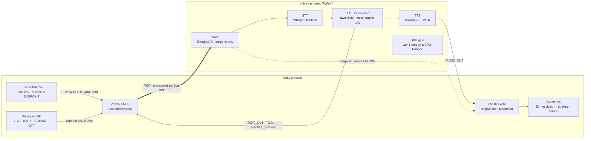

# VoiceRT — Talk to any NPC


**AI voice agents for game NPCs. Unity + FMOD first.**

We help Unity game developers give NPCs real, interruptible voice conversations without a recording budget, through one FMOD-native character asset, so players can talk to any NPC and get an in-character answer inside the game's own mix.

Status: working prototype. The FMOD programmer-instrument sink is live — compiled in Unity 6.3 LTS and verified with a real microphone, running fully local on one GPU (Whisper small.en → qwen3:8b via Ollama → Kokoro). The [status table](#quick-start-unity--fmod) says exactly what is verified.


<!-- TODO(Raph): record 20-30 s Unity scene: mic → NPC → FMOD event, barge-in shown. Then uncomment:

-->

**[Live page](https://ai-voice-agent-demo-rose.vercel.app/)**: the NPC pipeline, a scripted turn with a barge-in, the audio chain, the cost numbers and the roadmap.

---

## Why

- **Recording does not scale.** The SAG-AFTRA floor is $1,134.95 for a 4-hour day covering up to three voices, before studio, direction and retakes. Skyrim shipped around 60,000 lines; Starfield was announced at over 250,000. Nobody records an open world twice.
- **An AI voice has to be an ordinary voice.** Same FMOD buses, attenuation curves, occlusion, reverb sends and ducking the sound designer already built. Anything else means a second mix, and that is where AI dialogue starts to sound pasted on.
- **Cost per player is a budget, not a hope.** The runtime enforces a spending ceiling the same way it enforces latency. Out of budget means an authored line, never an error dialog.

The whole argument with numbers: [docs/economics.md](docs/economics.md).

---

## Quick start: Unity + FMOD

| Path | Status |
|---|---|
| Unity package (UPM, plain `AudioSource`) | wire protocol and PCM ring buffer verified against a live bridge from C# (13 xUnit tests, including a full turn plus a barge-in over a real socket); compiled and running end to end, including a Windows player build |
| FMOD programmer-instrument sink (Unity) | shipped — compiled in Unity 6.3 LTS with FMOD for Unity 2.03.14, verified live: mic → NPC → programmer sound → dialogue bus, with ducking and barge-in |
| Unreal + Wwise | protocol verified in standalone C++; Editor glue not exercised |

**1. Install the package.** `Window > Package Manager > +`, then either *Add package from git URL* pointing at the package subfolder (the repo root is not a package):

```
https://github.com/raphsoundmix-ctrl/voicert.git?path=/integrations/unity/com.voicert.npc
```

or *Install package from disk* and pick `integrations/unity/com.voicert.npc/package.json`. Unity records a `file:` reference, so pulling the repo updates the package.

**2. Attach it to the NPC.** Select the NPC's GameObject, `Add Component > VoiceRT > VoiceRT NPC`. It requires an `AudioSource`, so Unity adds one if it is missing. Fill in `Host`/`Port` (`127.0.0.1:8765` for local testing), `Npc Id`, `Character` and `Lore Scope` for this specific NPC.

**3. Optional: distance-based LOD.** `Add Component > VoiceRT > VoiceRT Dialogue LOD` on the same object. It opens and closes the bridge connection as the player crosses the LIVE-tier distance, which is what keeps a whole scene of NPCs from holding hundreds of open sockets.

**4. Press Play.** The demo starts the local server (and Ollama) itself; there is no separate Python command to run. To drive the bridge by hand instead:

```bash
python -m voicert.game.bridge 127.0.0.1 8765
```

In Play Mode the NPC connects, and `npc.Say("...")` (or the LOD component, once the player is close enough) drives a real turn. Add `VoiceRT Voice Input` next to `VoiceRT NPC` to talk to it with a real mic — hold the push-to-talk key, speak, release. The fully offline path is in [docs/local-stack.md](docs/local-stack.md).

The Unity component is compiled and running against the real engine: Unity 6.3 LTS with FMOD for Unity 2.03.14, including a Windows player build that starts its own server and holds a full local voice conversation. The Unreal component is not — its protocol and ring buffer are verified from standalone C++ against the same header the plugin ships, but `USoundWaveProcedural::QueueAudio` and `UAkAudioInputComponent` have never been exercised inside an Editor. Treat Unreal as a working prototype to drop in and iterate on, not a marketplace-ready asset yet.

### Run it without an engine

```bash
git clone https://github.com/raphsoundmix-ctrl/voicert.git
cd voicert
python -m venv .venv && .venv/Scripts/activate     # Linux/mac: source .venv/bin/activate
pip install -e ".[dev]"

python examples/run_demo.py npc        # one turn, a barge-in, then the NPC carries on
python examples/game_open_world.py     # dialogue LOD, pool, budget and cost model for 240 NPCs
pytest -q && mypy                      # 228 tests, strict typing, no API keys
```

The test suite and this example run deterministic stub providers through the same interfaces a real model would use, so they need no keys (the Unity demo runs the real local stack instead):

```
--- USER BARGES IN ---
truncated turn 4: “[npc] Understood: “Tell me a ” (spoken=29)

--- turn 3 (after the barge-in) ---
LLM context right now:
       user: Hi! Tell me what you can do.
  assistant: [npc] Understood: “Hi! Tell me what you can do.”. Here is a deliberately long an
       user: Tell me a long story.
       user: Okay, briefly: what is the plan for tomorrow?
```

The NPC drops an interrupted reply instead of keeping a marked stub: the story the player cut off never enters the history, so the prompt stays short and the lore stays clean. Every turn writes a structured JSON log line (`stt_final`, `llm_first_token`, `tts_first_audio`, `over_budget` against the 300 ms first-audio budget).

---

## How it works



Everything heavy (VAD, STT, the LLM, TTS) stays in the Python process, on your own GPU. The engine gets a few hundred lines of C#: one socket per live NPC, PCM queued into an ordinary engine sound, text and tool calls forwarded to your MonoBehaviour. The engine never runs a model. Unreal + Wwise is the same picture with `UAkAudioInputComponent` in the FMOD slot.

**What starts a reply.** Releasing the push-to-talk key does. A client that ends its own utterances owns the turn boundary: the VAD still opens capture and still drives barge-in, but it no longer closes a turn, so a pause mid-sentence is not the end of one. An open-mic client that never sends `ENDPOINT` keeps the old behaviour and endpoints on silence. Whisper then gets one whole utterance — feeding it individual chunks produces confident nonsense.

**Barge-in** is not a flag that something checks later. The VAD hears the player, and everything in flight is `task.cancel()`-ed at its next await point: LLM generation, TTS synthesis, the queues in between, and a `FLUSH` to the engine so nothing produced before the cut plays after it. The history keeps only the characters that were actually voiced (`mark_spoken()` only ever moves forward), so the NPC never remembers words the player never heard. The interrupt gate for an NPC is 0 ms, because game feel beats politeness. Internals: [docs/architecture.md](docs/architecture.md).

---

## What it costs

`voicert.economics` prices a turn from measured usage against rate cards read from the vendors on 2026-08-31 (`python tools/unit_economics.py`). The turn: 282 fresh + 700 cached prompt tokens, 23 output tokens, 92 characters synthesized, 3 s of player audio.

| stack | per turn | LLM | STT | TTS | $15 buys |
|---|---|---|---|---|---|
| all cloud, cheap | $0.001532 | 1.7% | 8.2% | **90.1%** | 9,792 turns |
| all cloud, premium | $0.005307 | 8.8% | 4.5% | **86.7%** | 2,826 turns |
| cloud brain, local voice | $0.000152 | 17.7% | 82.3% | 0% | 98,814 turns |
| premium brain, local voice | $0.000707 | 66.1% | 33.9% | 0% | 21,216 turns |
| fully on-device | $0.000000 | 0% | 0% | 0% | unbounded |

**Speech synthesis is about 90% of a cloud voice turn; the language model is under 2%.** Swapping to a cheaper LLM optimizes a rounding error. Local TTS is the 10× lever, and it is tractable where a local LLM is not: a Piper-class voice is ~60 MB of CPU-only inference. At $10 net per player and a 90% margin target, all-cloud funds 652 turns; moving only synthesis on-device funds 6,587. The ceiling is enforced at runtime: `BudgetDenied` carries an affordable authored fallback, reserve-then-settle holds under concurrency, and barge-in stops the meter. All of it, with the caveats: [docs/economics.md](docs/economics.md).

---

## Dialogue LOD

What you pay for is what the player can hear, not how many NPCs exist.

| Tier | What runs | Voice pool | LLM work |
|---|---|---|---|
| **LIVE** | full pipeline: STT → LLM → TTS, streamed | one slot | a streamed generation |
| **BARK** | the LLM picks a line from a pre-baked bank | none | one short classification call |
| **CROWD** | one shared murmur bed | none | none |
| **OFF** | nothing, NPC state frozen | none | none |

Live agents come out of a fixed-size pool with priority eviction, the way FMOD and Wwise already limit voices. `examples/game_open_world.py` walks a player across a market square of 240 NPCs:

```
DIALOGUE LOD    (240 NPCs in the square)
  LIVE      2 NPC   full STT+LLM+TTS, one pool slot each
  BARK      4 NPC   LLM picks a pre-baked line — no synthesis
  CROWD    53 NPC   one shared murmur bed
  OFF     181 NPC   nothing runs

PLAYER WALKS 40 m ACROSS THE SQUARE
  step 4: live= 32  bark= 43  crowd= 68  off= 97  | agents held: 7  ← capped
```

`live=` is how many NPCs qualify for the LIVE tier; `agents held:` is how many got a pool slot. The pool size is not a guess: `ComputeBudget(rtf=0.10, cpu_share=0.35, speaking_duty=0.5).max_pool_size()` returns 7, and synthesis runs off the render thread, so the 16.6 ms frame at 60 fps is untouched by design. Measure RTF on your minimum spec, not on your workstation. Tiers, hysteresis, bake-vs-generate: [docs/economics.md](docs/economics.md#four-tiers-and-only-one-of-them-is-expensive).

---

## Status and roadmap

- [x] Core pipeline, barge-in with history repair, the NPC profile, game layer (dialogue LOD, voice pool, compute budget), TCP engine bridge, economics ledger. 228 tests, mypy strict on 33 files.
- [x] **M1** FMOD programmer-instrument sink in the Unity package, compiled in Unity 6.3 LTS with FMOD for Unity 2.03.14 (`FMOD.Studio.EVENT_CALLBACK_TYPE.CREATE_PROGRAMMER_SOUND`). Verified with a real microphone: Whisper small.en → qwen3:8b (Ollama) → Kokoro, all CUDA-enforced, memory per (NPC, player), barge-in over a live gate. A Windows player build starts its own server — no manual Python or Ollama launch.
- [ ] **M2** Demo scene polish and a 30-second video; mic → NPC → FMOD event, barge-in and memory already run on screen.
- [ ] **M3** Local path (faster-whisper, Ollama, sherpa-onnx) runs end to end, GPU-enforced. Cloud adapters (Deepgram, Claude Haiku, ElevenLabs Flash) remain interface-only, not yet wired to a live key.
- [ ] **M4** UPM 0.1 release; Unreal + Wwise parity.

Language is a setting, not a port: the profile carries the prompt and the voice, and every planned provider is multilingual. VAD and barge-in listen for energy and speech, not words.

---

## Also: Unreal + Wwise

`integrations/unreal/VoiceRT/` is a `.uplugin` with the same protocol in header-only C++17, an `FSocket` + `FRunnable` client and a Blueprint-exposed `VoiceRTNpcComponent`. On the audio side, subclass `UAkAudioInputComponent`, override `FillSamplesBuffer` and `GetChannelConfig`, and start it with *Post Associated Audio Input Event*. Wiring for both middlewares, FMOD first: [docs/middleware-wiring.md](docs/middleware-wiring.md).

---

## Docs

| Document | What is in it |
|---|---|
| [docs/architecture.md](docs/architecture.md) | frames, barge-in internals, the NPC contract, design references, model choices, source layout |
| [docs/economics.md](docs/economics.md) | recording costs, the four tiers, frame budget, bake vs generate, the $/turn table, the cost ceiling, on-device as the lever, the field around it |
| [docs/licensing.md](docs/licensing.md) | Piper is GPL now, voice models are licensed separately, Kokoro, sherpa-onnx, Supertonic |
| [docs/middleware-wiring.md](docs/middleware-wiring.md) | FMOD programmer sound, plain Unity `AudioSource`, Wwise Audio Input, concurrency limits |
| [docs/audio-chain.md](docs/audio-chain.md) | input DSP before STT, output DSP before the FMOD bus |
| [docs/local-stack.md](docs/local-stack.md) | mic → Whisper → Ollama → sherpa-onnx, measured numbers, the caveats that cut against them |
| [docs/POSITIONING.md](docs/POSITIONING.md) | who this is for, bridge order, what is on and off the roadmap |

```
src/voicert/             frames, pipeline, interruption, state, config, tools, metrics, transport
src/voicert/game/        lod, pool, sinks (FMOD / Wwise contracts), budget, bridge (TCP server)
src/voicert/economics/   money (integer nano-dollars), prices, usage, ledger, planning
src/voicert/processors/  base contracts, stubs, adapter skeletons, local providers
integrations/unity/      com.voicert.npc UPM package + C# xUnit tests
integrations/unreal/     VoiceRT .uplugin + standalone C++ protocol tests
examples/                run_demo.py, game_open_world.py
tools/unit_economics.py  prints the cost table from measured usage
tests/                   228 tests: pipeline, barge-in races, turn boundaries, tool isolation, game layer, cost ceilings
```

---

## A note from the author

This is a working prototype. I am still building on it.

Over ten years in sound and voice; the design comes from the mix, not from an SDK: what processing belongs at each point of the chain, and what a voice must do to sit inside a game's audio. Vyacheslav Romanenko brings 14+ years of technical sound design and FMOD on PC, console and mobile. VoiceRT was selected for AltaLab, the accelerator run by AltaIR Capital; the Fall 2026 cohort is where the NPC asset ships.

— Raph

## License

MIT, © Raph. Pipecat, LiveKit Agents and Rapida AI were studied as design references; every design decision and the implementation here are original.
