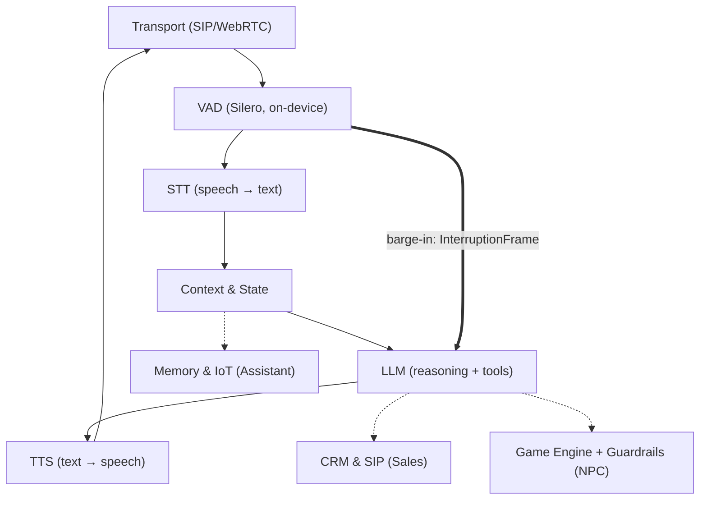

# VoiceRT — AI Voice Agents for Game NPCs

**A living NPC from a character sheet: real-time, in character, and you can interrupt it mid-sentence.**

An open-source AI voice agent system, built first for game NPCs. One asyncio core in Python, configured per job through three strict profiles — `sales`, `assistant`, `npc` — where each profile is a different contract, not a different prompt. The main solution is the NPC: design a character once, drop it onto any Unity or Unreal NPC, and talk to it inside the game's own audio.

[Pipecat](https://github.com/pipecat-ai/pipecat), [LiveKit Agents](https://github.com/livekit/agents) and Rapida AI were studied as references for how production voice-agent systems are put together. The architecture, the profile system, the game layer and the economics model here were designed from scratch, not ported.


**[Live demo](https://ai-voice-agent-demo-rose.vercel.app/)** — an interactive diagram of the three modes, a scripted session with an interruption, the audio chain, and where this is heading. Hosted on Vercel, deployed from this repo ([GitHub Pages mirror](https://raphsoundmix-ctrl.github.io/AI_Voice_Agent_Demo/)).

---

> ### The 30-second version
>
> A game designer called this economically dead on arrival: *"I sold a game for $10. A player burned $15 in tokens."* Measuring the real bill against live vendor rates said otherwise.
>
> | | |
> |---|---|
> | **90%** of a cloud voice turn's cost is speech synthesis — the LLM is under 2% | **10×** cheaper per turn moving synthesis on-device instead of chasing a smaller model |
> | **652 → 6,587** turns funded per $1 budget: cloud-only vs. hybrid local voice | **3 + 4** Blockers/Majors an adversarial review caught before shipping |
>
> Fix: an enforced spending ceiling on the voice, the same way this already enforces latency. [The rest of the industry is spending its money on exactly that pattern right now](#this-is-a-moving-field-not-a-lone-bet).

---

> ### A note from the author
>
> This is a working prototype. I am still building on it.
>
> I have worked with sound and voice for more than ten years, and that is where the design comes from. I know what processing belongs at each point of the chain, what is worth automating, and how it has to behave on a server.
>
> What I want is one agent that can be configured for almost any job. It should run locally, speak several languages, and be simple to plug into whatever you already have. A fully local knowledge base is the next step. The three profiles are not three products; they are one core, configured three ways.
>
> In games it connects to Wwise or FMOD. The engine sends the player's voice to the NPC, and the NPC answers inside the game world with no dialogue script behind it. The use I care about most is a personal assistant for a business owner, where the database, the reasoning, and the voice all end up on the phone and work without internet. Given a database, prepared prompts, and a voice, that is an engineering plan rather than a wish.
>
> — *Raph, 10+ years in sound and voice*

---

## One core, many jobs

The pipeline does not know or care which vendor is behind a stage. Every provider sits behind the same small adapter interface, so a cloud stage and an on-device stage are interchangeable.

### Games: a bridge into Wwise and FMOD

The game's audio middleware becomes the transport. Wwise or FMOD sends the player's voice into VoiceRT, and the NPC answers through the game's own audio bus, in character and inside the lore. No dialogue trees. The NPC profile already talks to the engine over WebSocket or gRPC, and its interrupt gate is 0 ms, so a player can talk over an NPC and it reacts like a person would.

**This is the focus.** VoiceRT was selected for **AltaLab**, the accelerator run by the **AltaIR Capital** fund. The Fall 2026 cohort is where this gets built with their support, and the goal is one complete NPC solution rather than a general framework: a character is designed once (who it is, what it knows, what it never says), packaged as a single engine asset with its voice and boundaries, dropped onto any NPC in Unity or Unreal, and talked to. The team pairs the AI side with 14+ years of technical sound design and FMOD work across PC, console and mobile, because the part of this problem that is shaped like a game is the audio, not the model.

Details, costs and wiring: [Voicing an open world](#voicing-an-open-world-what-it-costs) · engine assets: [Unity and Unreal](#drop-in-engine-assets-unity-and-unreal).

### Many languages, no rewrite

A language is a setting, not a port. The profile carries the prompt and the voice, and every planned provider is already multilingual: Whisper handles 99 languages locally, ElevenLabs and Cartesia ship multilingual voices behind one API. VAD and barge-in do not care about language at all, because they listen for energy and speech, not words.

### Local and private

The goal is an assistant whose knowledge base lives on the phone, with reasoning and speech running on the device, offline. Every stage of the pipeline already has a local option:

| Stage | Cloud (today) | On-device (the goal) |
|---|---|---|
| VAD | always local | Silero VAD |
| STT | Deepgram Nova-3 | faster-whisper on GPU/NPU |
| LLM | Claude Haiku / Sonnet | llama.cpp-class models |
| TTS | ElevenLabs / Cartesia | Piper / Kokoro on desktop — see the caveats below for phones |
| Memory | any vector DB | sqlite-vec, a vector database in one file |

One caveat on that last row, because it is the row that decides whether the phone version happens. Piper's licensing and Kokoro's speed on low-power ARM both rule them out for a phone target as things stand today (details in [Licensing](#licensing-will-bite-you-before-performance-does)). Nothing has been benchmarked on a phone yet. The current candidate is sherpa-onnx with an espeak-free voice, and that still has to be measured.

The demo already runs stub providers through the same interfaces a real model would use. 121 tests pass through those seams, so switching to a local model is an adapter, not a rebuild.

---

## Why build another one

Three mature systems each solve a different part of the problem:

| Framework | Languages | Best at | Level |
|---|---|---|---|
| **Pipecat** | Python | Fast prototyping, many ready integrations | Code (you assemble the pipeline) |
| **LiveKit Agents** | Python, Node.js | WebRTC infrastructure, semantic turn detection | Infrastructure (WebRTC server) |
| **Rapida AI** | Go, TypeScript | Turnkey platform with an admin UI, gRPC | Platform (UI plus backend) |

None of them treats strict named profiles as the core idea, where each profile has its own latency contract, its own isolated set of tools, and its own context policy. VoiceRT does. That is why they were used as references to learn from rather than as code to build on (ADR-001 records the decision).

**Why Python and asyncio.** The voice-AI ecosystem lives in Python: Silero VAD, faster-whisper, every vendor SDK. A voice agent is almost pure I/O, and asyncio handles that cheaply. Most importantly, asyncio can cancel a task at any await point, and barge-in is built directly on that.

The core has no external dependencies. It installs in seconds and there is very little to audit. The heavy pieces (aiortc, onnxruntime, httpx) are optional extras.

---

## Architecture



### Frames instead of callbacks

Everything moving through the system is an immutable frame: `AudioFrame`, `TextFrame`, `FunctionCallFrame`, `InterruptionFrame`, `EndFrame`. The processors (`STTService`, `LLMService`, `TTSService`) are joined by asyncio queues and talk only in frames. Adding a provider means writing one class of about 50 lines. The core stays untouched.

### Barge-in

Each frame is handled in its own child asyncio task. An interruption is not a flag that something checks later. It is `task.cancel()`, and the runtime delivers it at the next await point:

```
VAD: speech_start
  └─ profile gate (250 / 120 / 0 ms — an "uh-huh" should not kill a sales pitch)
      └─ pipeline.interrupt()
           1. cancel everything in flight (LLM generation, TTS synthesis)
           2. drain the queues, so nothing produced before the cut plays after it
           3. on_interrupt() on every processor, to flush buffers
           4. InterruptionFrame → transport, to flush playback
      └─ state.interrupt_assistant(turn)
```

That last step matters more than it looks. The LLM may have written 400 characters while TTS only voiced 90. Only those 90 go into the dialogue history, so the agent never "remembers" words the user never heard. The TTS processor reports progress through `mark_spoken()`, which only ever moves forward, so a late report arriving after the cut cannot stretch the spoken part.

Cancellation uses `asyncio.Task.cancel()` rather than a hand-rolled flag. The runtime raises `CancelledError` at every await, so a provider cannot forget to check anything. Full reasoning is in the docstring of `voicert/interruption.py`.

### Profiles are contracts

`ConfigFactory.build("sales" | "assistant" | "npc")` returns a wired runtime. The profiles differ structurally, not just in wording:

| | `sales` | `assistant` | `npc` |
|---|---|---|---|
| Transport | SIP / Twilio (8k μ-law) | WebRTC (Opus 48k) | WebRTC + WS/gRPC to the engine |
| Tools | CRM only: `crm_lookup`, `crm_update_deal`, `crm_log_objection`, `schedule_callback`, `transfer_to_human` | `web_search`, `calendar_create`, `memory_store/recall`, `iot_command`, `os_open_app` | engine only: `emit_game_event`, `query_world_state`, `play_animation` |
| Interrupt gate | 250 ms, tolerant of back-channel | 120 ms | **0 ms** |
| Interrupted reply | kept and marked, since an interruption usually signals an objection | kept and marked | **dropped**, for cleaner lore and a shorter prompt |
| First LLM token | 500 ms | 400 ms | **150 ms** |
| First audio out | 1000 ms | 800 ms | **300 ms** |

Both latency numbers are deadlines measured from the same moment, the end of the user's speech, so they are not added together. `over_budget` in the logs fires when the first audio chunk misses the second one.

Each profile gets its own set of tools, and the sets do not overlap. Tests check this. An NPC cannot call the CRM: even if a prompt injection tells it to call `crm_lookup`, the tool is not there and the call raises `PermissionError`. The guardrail is in the structure, not in the prompt.

---

## Voicing an open world: what it costs

Two questions come first for any game developer. What does it cost to run, and does it pay for itself? Both have numbers here, and the `voicert.game` module implements the answer.

### What recorded dialogue costs

You pay for recorded dialogue once, and again every time the script changes. The SAG-AFTRA Interactive Media Agreement minimum for an off-camera Day Performer is **$1,134.95 for a 4-hour day covering up to three voices** and **$2,270.78 for a 6-hour day covering 6–10 voices** (contract year 2025-11-01 to 2026-10-31). That is the floor, before studio time, direction, engineering, editing and retakes, and before any name talent.

Then look at the scale. Skyrim shipped around **60,000 lines**. Fallout 4, **111,000**. Starfield was announced at **over 250,000 lines** (Bethesda's own pre-release count from October 2022). Baldur's Gate 3 holds the Guinness record with **2,121,425 words of character dialogue** across 500+ voiced characters and 240+ actors. A two-person studio cannot buy that once, let alone twice.

The industry has already moved. **7,818 Steam titles disclosed generative AI use** in a July 2025 analysis, roughly 7% of the library and about one in five games released that year, up from around 1,000 titles in all of 2024. The 2024–25 strike settled with real terms attached: informed written consent for each use, disclosure, and usage reports within 90 days of release. Synthetic voice is not a way around performers. It is a way to voice the bulk of an open world that nobody was ever going to record.

### Four tiers, and only one of them is expensive

Dialogue gets a level-of-detail system, the same way geometry does. What you pay for is what the player can hear, not how many NPCs exist.

| Tier | What runs | Voice pool | LLM work |
|---|---|---|---|
| **LIVE** | full pipeline: STT → LLM → TTS, streamed | one slot | a streamed generation |
| **BARK** | the LLM picks a line from a pre-baked bank | none | one short classification call |
| **CROWD** | one shared murmur bed | none | none |
| **OFF** | nothing, NPC state frozen | none | none |

BARK is where most of an open world lives, so it is worth being precise about it. There is no synthesis and no new audio asset, just playback of a line you already shipped. The LLM is still involved, but only to choose which line fits, which is a far cheaper call than generating speech.

Each threshold has a wider exit distance than its entry distance: an NPC enters LIVE at 6 m but only drops out of it at 9 m. Without that gap, a player walking along the boundary would create and destroy agents on every render frame.

An NPC you are actually talking to stays LIVE whatever the distance, so walking away mid-sentence does not cut the character off.

Live agents come out of a fixed-size pool. When it is full, the lowest-priority agent is dropped, which is how Wwise and FMOD already handle voices. A quest-giver outranks an ambient vendor, and anything dropped falls back to the bark tier instead of going silent. In `examples/game_open_world.py`, a market square with 240 NPCs never holds more than 7 agents, however the crowd moves:

```
DIALOGUE LOD    (240 NPCs in the square)
  LIVE      2 NPC   full STT+LLM+TTS, one pool slot each
  BARK      4 NPC   LLM picks a pre-baked line — no synthesis
  CROWD    53 NPC   one shared murmur bed
  OFF     181 NPC   nothing runs

PLAYER WALKS 40 m ACROSS THE SQUARE
  step 4: live= 32  bark= 43  crowd= 68  off= 97  | agents held: 7  ← capped
```

The two counts on the last line measure different things. `live=` is how many NPCs are close enough to qualify for the LIVE tier, and `agents held:` is how many actually got a pool slot. When the first number exceeds the pool size, the rest fall back to BARK. That gap is the cap working.

### It stays out of the frame budget

At 60 fps you get 16.6 ms per render frame, and speech synthesis gets none of it. Synthesis runs off the render thread, so what actually limits you is a fraction of one CPU core, set by the real-time factor of your TTS. RTF is seconds of CPU per second of audio produced, so anything below 1.0 is faster than real time.

The sherpa-onnx maintainers measured Piper VITS voices on a **Raspberry Pi 4**: **RTF 0.774–0.812 on one thread**, **0.349–0.357 on four**, with 61–75 MB per medium-quality voice. If a Pi 4 can synthesize faster than real time on a single core, a gaming PC is not the bottleneck. On Apple silicon, Supertonic reports **RTF 0.012–0.015 on an M4 Pro CPU**, roughly 70 times faster than real time.

`ComputeBudget` turns that into a pool size instead of a guess:

```python
from voicert.game import ComputeBudget
ComputeBudget(rtf=0.10, cpu_share=0.35, speaking_duty=0.5).max_pool_size()  # -> 7
```

Measure RTF on your minimum spec, not on your workstation.

NVIDIA's shipped work uses the same split. In PUBG's Ally Duo, a System-1 behaviour tree handles reflexes at game tick rate while the System-2 model reasons separately, so reflexes never wait for the model. VoiceRT works the same way: the pipeline is never on the frame's critical path.

### Bake what you can, generate what you cannot

| Stage | Baked at build time | On the player's device | Cloud |
|---|---|---|---|
| Static dialogue | yes, best quality TTS, paid once | — | — |
| Reactive barks | — | yes, local TTS, $0 per player | — |
| Open conversation | — | yes, small local LLM plus local TTS | optional, for the big moments |

Baking is the default for a reason. Commodity cloud TTS costs **$4–$30 per 1M characters** (Google Standard/WaveNet $4, Neural2 $16, Chirp 3 HD $30; Amazon Polly Standard $4, Neural $16, Generative $30). At that price a 10,000-line bank is a rounding error, and re-baking it after a script change costs nothing.

Whatever cannot be baked runs on the player's hardware, where each extra line costs the studio nothing. That is what makes dynamic dialogue possible at all: the cost does not grow with units sold.

Games ship this today. PUBG's Ally Duo runs a quantized **2B Mistral-NeMo-Minitron entirely on-device** (an RTX GPU with at least 8 GB of VRAM, shared with the game) next to a Parakeet ASR and KRAFTON's own TTS. inZOI's Smart Zoi uses a **0.5B** Minitron, and NVIDIA says a 2B Minitron "fits in as little as 1.5 GB of VRAM". On phones, **Gemma 3 1B is 529 MB at int4 QAT** and reaches about 2,585 tok/s prefill on a Galaxy S24 Ultra (Google suggests at least 4 GB of device memory). Meta's 4-bit Llama 3.2 1B/3B cut size by 56% and memory by 41%, with decode 2.5 times faster. Apple's roughly 3B on-device model runs at about 30 tok/s on an iPhone 15 Pro and is free to developers through the Foundation Models framework.

Where cloud really is the right answer, small models are cheap: **$0.05–$1.00 per 1M input tokens** (gpt-5-nano $0.05/$0.40, Gemini 2.5 Flash-Lite $0.10/$0.40, Claude Haiku 4.5 $1.00/$5.00). Set a cap per session and fall back to the bark bank when you hit it. VoiceRT treats that as a normal tier change, not an error.

### Licensing will bite you before performance does
<a id="licensing-will-bite-you-before-performance-does"></a>

The engine most people reach for first will not survive legal review.

**Piper** now lives at `OHF-Voice/piper1-gpl` and is **GPL-3.0**. The old MIT `rhasspy/piper` was archived read-only on 2025-10-06. Piper embeds espeak-ng, which is GPL, so linking against it makes your binary a derived work that has to ship under GPL-3.0 too. Dynamic linking does not get you out of that. Pinning the archived MIT code does not help either, because its CMake still pulls in and links GPL espeak-ng.

Two routes work. Run Piper as a separate process, which is normally treated as mere aggregation, though you still ship a GPL binary alongside your game. Talk to a lawyer about that, and note that the GPLv3 Installation Information requirement is a real problem on locked consoles. Or use an MIT fork with an espeak-free G2P, such as `ayutaz/piper-plus`.

**Voice models are licensed separately from the engine.** Piper's own docs say so, and `en_US-lessac`, the voice in its examples, is under the restrictive Blizzard 2013 license. Read the `MODEL_CARD` of every voice you ship.

**Kokoro-82M is Apache-2.0, weights included** (8 languages, 54 voices, 86–326 MB of ONNX). Clean licensing, but it measured **RTF 2.77–6.63 on a Raspberry Pi 4**, so it is not real time on a low-power ARM chip. Fine on desktop; benchmark it before you commit a Switch-class handheld target.

**sherpa-onnx** (Apache-2.0) is the easiest runtime to ship: Windows, Linux, macOS, Android, iOS, on x86, ARM and RISC-V, with 12 language bindings and no network needed. It still pulls in GPL espeak-ng through piper-phonemize, though there is an open upstream issue to remove it.

**Supertonic** has the fastest CPU numbers here, but its weights are OpenRAIL-M, which restricts use rather than being plainly permissive.

None of this stops you shipping. It means choosing the stack with a lawyer in the room. Because every provider sits behind the same adapter interface, changing that choice later is a swap rather than a rewrite.

### Wiring it into Wwise and FMOD

The rule is simple: an AI voice has to be an ordinary voice. Same buses, attenuation curves, occlusion, reverb sends, ducking and voice limiting that the sound designer already set up. Anything else means keeping a second mix alive, and that is where AI dialogue starts to sound pasted on.

**Wwise** uses the stock Audio Input source plug-in. Register three global callbacks once with `SetAudioInputCallbacks()`. The engine calls the format callback when playback starts and the execute callback on every audio frame, until you stop it or return `AK_NoMoreData`. In Unreal, subclass `UAkAudioInputComponent`, override `FillSamplesBuffer` and `GetChannelConfig`, and start it with **Post Associated Audio Input Event**; a plain PostEvent will not drive the plug-in. The transport is well proven: ReadSpeaker's speechEngine, 4Players ODIN voice chat and Unreal AudioLink all use it.

**FMOD** uses a user-created sound. Call `System::createSound` with `FMOD_OPENUSER` and an `FMOD_CREATESOUNDEXINFO` carrying `defaultfrequency`, `numchannels`, `format` and `pcmreadcallback`, and FMOD pulls PCM in `decodebuffersize` blocks. Pass that sound to a programmer instrument through `FMOD_STUDIO_EVENT_CALLBACK_CREATE_PROGRAMMER_SOUND`, release it in the matching DESTROY callback, and the generated voice inherits the event's 3D panning, buses and effects.

Let the middleware handle concurrency. FMOD separates `maxchannels` (virtual voices, usually 256–1024) from `setSoftwareChannels` (real mixed voices, 64 by default). Wwise resolves per-object, per-bus and project-wide playback limits by priority, with Virtual Voice Behavior deciding what happens beyond the cap. Keep the dialogue pool well under those numbers.

Without middleware, use Unity's `OnAudioFilterRead` or `AudioClip.Create(..., stream: true, PCMReaderCallback)`, or Unreal's `USoundWaveProcedural::QueueAudio` (push) or `ISoundGenerator::OnGenerateAudio` through `USynthComponent` (pull).

`voicert.game.sinks` defines the contract: `push(pcm, sample_rate)` and `flush()`. That is all the native shim has to implement. `flush()` is the barge-in path and has to drop queued audio immediately, or the NPC carries on talking after the player cut them off.

### Try it

```bash
python examples/game_open_world.py     # LOD, pool, budget, cost model
pytest tests/test_game_layer.py -q     # 23 tests covering all of it
```

---

## Drop-in engine assets: Unity and Unreal

`voicert.game.bridge` is the Python side of a small TCP protocol built for this. Everything heavy — VAD, the LLM, TTS, the voice pool — stays in the Python process. Each engine gets a thin client: a few hundred lines that open one socket per live NPC, queue the incoming audio into an ordinary engine sound, and forward text and tool calls to your Blueprint or MonoBehaviour graph. The engine never runs a model.

```
┌─────────────── engine process (Unity / Unreal) ───────────────┐   ┌──────── voicert process ────────┐
│                                                                 │   │                                  │
│  NPC actor                                                     │   │  EngineBridgeServer (asyncio)     │
│  ┌──────────────┐   distance, priority    ┌─────────────────┐  │   │  one connection = one NPC turn    │
│  │ Dialogue LOD │ ───────────────────────▶│ VoiceRT NPC      │──┼───┼─▶ ConfigFactory.build("npc")      │
│  │ (per-actor)  │  connect only if LIVE   │ component/script │  │TCP│    ├─ STT · VAD · barge-in         │
│  └──────────────┘                          └─────────────────┘  │   │    ├─ LLM (lore-locked prompt)     │
│         ▲                                        │  ▲           │   │    └─ TTS → PCM16 mono 16 kHz      │
│         │ player position each frame             │  │ AUDIO_OUT │   │                                  │
│         │                                  TEXT_IN│  │TEXT_OUT  │   │  NPCVoicePool caps concurrent      │
│  ┌──────────────┐                                 │  │TURN_END  │   │  live agents (see cost model      │
│  │ AudioSource / │◀── PCM16 ring buffer ───────────┘  │FLUSH     │   │  above) — bounded regardless of   │
│  │ SoundWaveProc.│    (resampled to device rate)      │TOOL      │   │  how many NPCs exist in the world │
│  └──────────────┘                                     ▼          │   │                                  │
│    3D attenuation, occlusion,               subtitles · gestures │   └──────────────────────────────────┘
│    reverb — all engine-native               · animation triggers │
└─────────────────────────────────────────────────────────────────┘
```

One TCP connection per LIVE-tier NPC; everyone in BARK/CROWD/OFF holds no connection at all, so the socket count on the engine side already matches `NPCVoicePool.capacity`, not the size of the world.

### What it costs to run

Two budgets, both bounded by design rather than by luck.

**Network and CPU, per live NPC.** PCM16 mono at 16 kHz is 32 KB/s down; text and tool frames are a few hundred bytes each. On a LAN or the same machine this is nothing. The ring buffer on the engine side (`PcmRingBuffer` in C#, the equivalent in C++) holds 0.25–5 seconds of audio and resamples on the audio thread with linear interpolation — no allocation, no lock held across the resample, so it cannot glitch the audio callback even under load. Measured on this machine: the whole protocol layer round-trips through a real Python bridge process in the C# xUnit suite (`BridgeIntegrationTests.cs`) in about 2 seconds for two full turns including a barge-in, with zero allocation-related failures across repeated runs.

**Memory, per live NPC.** The engine side holds one ring buffer (default 2 s × 16 kHz × 2 bytes ≈ 64 KB) plus one procedural sound object. That is the entire footprint — no model weights, no ONNX runtime, no phoneme tables live in the game process, because none of that runs there. The number of *possible* NPCs in the world costs nothing at all: an NPC in the BARK or CROWD tier is just game state (a `DialogueTier` enum and a couple of floats) until it earns a LIVE slot.

**What actually gates you** is the same CPU budget from the cost model above, on the *voicert* side: `ComputeBudget(rtf, cpu_share).max_pool_size()`. That number is your realistic concurrent-NPC-conversation limit, independent of how large the open world is.

### Big voice banks: what actually needs baking, and what does not

A large NPC roster has always meant two separate costs, and this framework only removes one of them.

**Recording is the cost this removes.** A cast of hundreds of NPCs, each with even a modest line count, is a SAG-AFTRA session-rate problem before it is anything else (see the cost model above). Runtime synthesis for the LIVE and BARK tiers sidesteps that recording bill entirely — there is nothing to record for a line the LLM composes at runtime.

**Engine setup is the cost that does not disappear, whichever way you produce the audio.** Every clip Unity or Unreal plays still needs the same decisions: Unity's *Load Type* (`Decompress On Load` for short, frequently-triggered barks vs `Streaming` for long lines) and compression settings per platform; Unreal's compression per `USoundWave` and whether a line lives on a `Sound Cue` or a MetaSound. VoiceRT does not touch this, because runtime-synthesized audio is not a `.wav` asset at all — the PCM never becomes an import-time decision, it becomes a stream. That is the actual optimization for a "huge voice bank": most of it stops being a bank. Static, pre-written lines (the "baked" row in the cost model's hybrid table) are the only ones that still go through normal asset import, and they are the minority by design — the framework routes reactive barks and open conversation through the live pipeline specifically so they never need a Load Type decision at all.

Two engine-side costs are out of scope for this repo and worth planning for separately: **lip-sync**, which needs either a runtime viseme generator (Meta's Movement SDK / Oculus Lipsync, NVIDIA Audio2Face) driven off the same PCM this bridge delivers, or a MetaHuman-style offline pass, which only applies to pre-baked lines; and **voice identity**, since giving hundreds of NPCs distinct voices is a TTS-model question (multi-speaker models, voice-cloning, or per-archetype voice banks), not an engine-integration one — the bridge's `voice` field in `HELLO` is where that choice plugs in once you pick a TTS backend.

### Get the code

```
integrations/
  unity/
    com.voicert.npc/            # UPM package — drop into Packages/ or add via git URL
      Runtime/Core/             # engine-agnostic: protocol codec, PCM ring buffer
      Runtime/VoiceRTNpc.cs     # MonoBehaviour: AudioSource + streaming AudioClip
      Runtime/VoiceRTLod.cs     # dialogue LOD component (distance -> tier -> connect)
      Runtime/VoiceRTMicrophone.cs
    tests/VoiceRT.Core.Tests/   # dotnet test — compiles the shipped package sources directly
  unreal/
    VoiceRT/                    # .uplugin — drop into Plugins/
      Source/VoiceRT/Public/VoiceRTProtocol.h   # engine-agnostic: header-only C++17
      Source/VoiceRT/Private/VoiceRTClient.*    # FSocket + FRunnable reader thread
      Source/VoiceRT/Public/VoiceRTNpcComponent.h  # UActorComponent, Blueprint-exposed
    tests/protocol_test.cpp     # standalone MSVC/g++ build, no Unreal required
```

```bash
# start the bridge (stub providers, no API keys needed)
python -m voicert.game.bridge 127.0.0.1 8765

# C# protocol + ring-buffer tests, plus a real cross-language run against the bridge above
cd integrations/unity/tests/VoiceRT.Core.Tests && dotnet test

# C++ protocol + ring-buffer tests (no Unreal install required)
integrations/unreal/tests/build_and_test.bat
```

Both engine components are un-compiled against the real engines in this repo — there is no Unity or Unreal installed on this machine to link against `UnityEngine.dll` or `UnrealBuildTool`. What *is* verified: the wire protocol and the PCM ring buffer, cross-checked against a live `voicert.game.bridge` process from both C# (13 xUnit tests, including a full turn plus a barge-in over a real socket) and standalone C++ (protocol + ring-buffer checks against the same header the plugin ships). The engine-specific glue — `AudioClip.Create`, `OnAudioFilterRead`, `USoundWaveProcedural::QueueAudio`, `UAkAudioInputComponent` — follows each engine's documented API shape but has not been exercised inside an Editor. Treat it as a working prototype to drop in and iterate on, not a marketplace-ready asset yet.

### Talking to an NPC with a real microphone, fully offline

No cloud, no API keys. Every stage has a local counterpart, and three of the four are already wired.

```
Unity Microphone ──PCM16 16 kHz──▶ AUDIO_IN ──▶ [ VAD ] ──▶ [ UtteranceSegmenter ]
                                                   │                    │
                                    barge-in ◀─────┘        one whole utterance
                                                                        ▼
        AudioSource ◀── AUDIO_OUT ◀── [ TTS ] ◀── sentences ◀── [ local LLM ] ◀── [ Whisper ]
```

**The part that is not obvious.** A microphone hands you 20-50 ms chunks forever; Whisper wants one complete utterance. Something has to decide where an utterance begins and ends, and feeding the model individual chunks produces confident nonsense — every chunk looks like a complete short sentence to it. `voicert.utterance.UtteranceSegmenter` is that decision. It keeps a rolling **pre-roll** buffer (300 ms by default) and prepends it when the VAD fires, because a VAD needs energy before it triggers — without pre-roll the model hears "ello" instead of "hello". It also drops anything under 250 ms (coughs, chair scrapes) and force-flushes past 20 s, so a fan near the mic cannot grow the buffer until the process dies. Set `transport.segmenter` and only whole utterances reach the pipeline; leave it unset and the old chunk-per-frame behaviour is unchanged.

The second non-obvious piece is **sentence chunking before TTS**. Feeding the LLM's token stream straight into synthesis gives every word its own falling intonation. `SentenceBuffer` holds tokens until a sentence boundary, then releases the whole clause, so TTS can place stress and breath — with a character-count escape hatch for models that forget punctuation.

**Measured on this machine** (RTX 4080 16 GB, Ollama, `keep_alive=-1`, `think=false`, streamed `/api/chat`, timed to the first content chunk). A 12-turn tavern-keeper conversation with a 696-token persona prompt, prompt tokens plateauing at ~980:

| Model | warm TTFT | full reply | cold first call | model file | VRAM actually held |
|---|---|---|---|---|---|
| `qwen3:1.7b` | **45 ms** | ~121 ms | 322 ms in-process / ~34 s from disk | 1.7 GB | **~2.3–2.7 GB** |
| `qwen3:14b` | ~41 ms | ~710 ms | 7 959 ms | 9.6 GB | ~9.5 GB |

Three things a game has to act on.

**Time-to-first-token barely separates the two models — decode speed does.** Both prefill a short prompt in roughly 40 ms. The 1.7B finishes a reply in ~121 ms against the 14B's ~710 ms, and since first audio waits on the first *sentence* rather than the first token, that 5.9× gap is what actually pushes the 14B past the NPC profile's budget.

**The VRAM column is what the card holds, not the file size.** `ollama ps` reports 1.7 GB for `qwen3:1.7b`; `nvidia-smi` taken at the same moment reports 2.3–2.7 GB, because the file excludes the KV cache and CUDA context. Budget against the larger number.

**Ollama evicts an idle model by default** — `ollama ps` shows `UNTIL 4 minutes from now` — so the first NPC to speak after a quiet stretch pays a cold load measured here at ~34 s from disk. `OllamaLLM` therefore defaults to `keep_alive=-1` and exposes `await llm.warmup()` for level load.

Two caveats that cut against these numbers, stated because they are the ones a reader would otherwise have to discover for themselves:

- **This was an idle machine.** No game was rendering on the same GPU. Contention for VRAM, SM time and thermal headroom is unmeasured here, and on Windows the failure mode when you get it wrong is a stutter, not a smaller number.
- **1.7B is fast but does not hold character.** Across the same 12 turns it referred to the innkeeper in the third person *from inside his own mouth* on four of them, regurgitated a few-shot example nearly verbatim, and contradicted its own room price. Latency at that size is solved; fidelity is not. Treat the local tier as a real option for barks and ambient chatter, and assume a larger model — local or cloud — for anything a quest depends on.

**Wiring it up:**

```bash
pip install -e ".[local]"          # faster-whisper + httpx + sherpa-onnx
ollama pull qwen3:1.7b
```

```python
from voicert.config import ConfigFactory
from voicert.processors.local import OllamaLLM, SherpaOnnxTTS, WhisperSTT
from voicert.utterance import UtteranceConfig, UtteranceSegmenter

runtime = ConfigFactory.build("npc", processors=[
    WhisperSTT(ctx, model_size="base.en", device="cuda", compute_type="float16"),
    OllamaLLM(ctx, model="qwen3:1.7b"),
    SherpaOnnxTTS(ctx, model="voice.onnx", tokens="tokens.txt"),
])
runtime.transport.segmenter = UtteranceSegmenter(UtteranceConfig(), sample_rate=16_000)
await runtime.ctx.llm.warmup()     # during level load, not on first line
```

On the Unity side add `VoiceRT Microphone` next to `VoiceRT NPC` — it already streams PCM16 mono 16 kHz into `AUDIO_IN`, which is exactly what the segmenter and Whisper expect.

**One gotcha worth planning for.** With the mic always open, the VAD hears the NPC's own voice through the player's speakers and fires barge-in at itself. Headphones make it disappear; otherwise use push-to-talk (gate `SendMicAudio` behind a key) or real acoustic echo cancellation. Do not "fix" it by muting the mic while the agent speaks — that removes barge-in, which is the whole point of the design.

**Status:** the segmenter and sentence buffer are covered by 14 tests and the local LLM path has been run end-to-end against a live Ollama on this machine (numbers above). `WhisperSTT` and `SherpaOnnxTTS` follow their libraries' documented APIs but have not been executed here — neither package is installed in this environment, and no voice model has been downloaded.

### Adding it to a Unity 6 project

Two things to get out of the way first. **Unity Cloud** (the platform at `docs.unity.com/en-us/cloud` — Asset Manager, DevOps, build automation, multiplayer services) is unrelated to this: it is Unity's hosted-services product, not the mechanism for adding a package to a project. Attaching a component to a GameObject is a purely local Editor operation, whether the package came from disk or from a URL. And this package targets plain UnityEngine APIs (`AudioSource`, `AudioClip.Create`), so nothing about it is Unity-6-specific — it installs the same way in Unity 6 as any other custom package.

**1. Install the package.** In the Unity 6 Package Manager (`Window > Package Manager > + `), either:

- **From a git URL**, pointing at the subfolder this package actually lives in — the repo root is not a package, `integrations/unity/com.voicert.npc/` is:
  ```
  https://github.com/raphsoundmix-ctrl/AI_Voice_Agent_Demo.git?path=/integrations/unity/com.voicert.npc
  ```
  Package Manager fetches straight from GitHub; nothing to clone by hand.
- **From disk**, if you already have the repo checked out: `+ > Install package from disk`, then browse to `integrations/unity/com.voicert.npc/package.json` and double-click it. Unity records this as a `"file:"` reference in `Packages/manifest.json` rather than copying the files, so pulling the repo updates the package too.

**2. Attach it to the NPC.** Select the NPC's GameObject (or create one), then `Add Component > VoiceRT > VoiceRT NPC`. `VoiceRTNpc` requires an `AudioSource`, so Unity adds one automatically if it is missing. Fill in the Inspector fields: `Host`/`Port` for the bridge (`127.0.0.1:8765` for local testing), `Npc Id`, `Character`, and `Lore Scope` for this specific NPC.

**3. Optional: wire up distance-based LOD.** `Add Component > VoiceRT > VoiceRT Dialogue LOD` on the same object. It disables `Connect On Begin Play` on `VoiceRTNpc` automatically and instead opens/closes the bridge connection itself as the player crosses the LIVE-tier distance — this is what keeps a whole scene of NPCs from holding hundreds of open sockets at once.

**4. Run the bridge, then press Play.** From the repo root: `python -m voicert.game.bridge 127.0.0.1 8765`. In Play Mode the NPC connects, and `npc.Say("...")` (or the LOD component, once the player is close enough) drives a real turn — the same pipeline the Python tests exercise, now feeding an `AudioSource` in your scene.

Everything Unreal-side works the same way conceptually — `Plugins > Add > from disk` or a git submodule pointing at `integrations/unreal/VoiceRT/`, then `Add Component > VoiceRT NPC` on the Actor — see `VoiceRTNpcComponent.h` for the exposed Blueprint properties and delegates.

---

## What a talking NPC costs to run

A game designer put the objection better than most:

> I sold a game for $10, and a player burned $15 of tokens.

That is the right objection, and a one-time price against a per-use meter is a real structural problem. A subscription can absorb a heavy user by averaging them against a light one. A $10 purchase cannot: the revenue arrives once and the meter keeps running, and there is no playtime at which it stops. So the question is not whether that can happen. It is what the actual numbers are, and what in the framework stops them.

### First, the bill is not where the argument assumes

`voicert.economics` prices a turn from measured usage against rate cards read from the vendors on 2026-08-31. Run it yourself:

```bash
python tools/unit_economics.py
```

The turn is the real one from the benchmark above: 282 fresh + 700 cached prompt tokens, 23 output tokens, 92 characters synthesized, 3 s of player audio.

| stack | per turn | LLM | STT | TTS | $15 buys |
|---|---|---|---|---|---|
| all cloud, cheap | $0.001532 | 1.7% | 8.2% | **90.1%** | 9 792 turns |
| all cloud, premium | $0.005307 | 8.8% | 4.5% | **86.7%** | 2 826 turns |
| cloud brain, local voice | $0.000152 | 17.7% | 82.3% | 0% | 98 814 turns |
| premium brain, local voice | $0.000707 | 66.1% | 33.9% | 0% | 21 216 turns |
| fully on-device | $0.000000 | 0% | 0% | 0% | unbounded |

**Speech synthesis is ~90% of a cloud voice turn. The language model is under 2%.** Everyone says "tokens", and tokens are the cheapest part. Swapping to a cheaper LLM optimizes a rounding error.

That reframes the fix. The lever is not the model — it is the voice. And **local TTS is tractable where a local LLM is not**: a Piper-class voice is ~60 MB of CPU-only inference with no GPU, no CUDA and no vendor lock, so it runs on the ~47% of Steam machines with 8 GB of VRAM or less and the ~27% whose GPU is not NVIDIA (Steam Hardware Survey, July 2026). Moving that one modality on-device is a 10× cut. `PriceBook.hybrid_local_tts()` is that configuration.

### Second, the meter needs a stop

Every profile here already declares a **latency** budget and the pipeline holds it. `voicert.economics` gives a profile a **money** budget on the same footing:

```python
policy  = BudgetPolicy.from_revenue("10.00", margin_target=0.90)  # $1.00/player, enforced
session = SessionLedger("tavern", PlayerLedger("p1", policy), policy, PriceBook.hybrid_local_tts())

auth = session.authorize(estimate, TierPlan.local_tts())
if isinstance(auth, BudgetDenied):
    play(auth.fallback)          # pre-authored line — always affordable, never an error
else:
    session.settle(auth, actual)
```

Three properties, each tested:

- **Denial is a value, not an exception.** Running out of budget returns a `BudgetDenied` carrying an affordable `fallback`; only programmer error raises. A player must never meet an error dialog because a studio hit a spending cap — they should meet an NPC reading its authored lines.
- **Reserve, then settle.** Two NPCs talking to one player can each pass an affordability check and jointly bust the cap. Check-and-hold is one atomic step, so the ceiling holds under concurrency.
- **The ledger alone cannot make the ceiling hard, and says so.** By the time `settle()` runs the provider has already generated the tokens and the money is gone, and the estimate is *systematically* low because output length is unknown at authorize time. So `Authorization` hands the caller the cap — `auth.max_characters(book)` and `auth.max_output_tokens(book)` — to pass down to the provider. Use them and the bound is hard; ignore them and it is "the ceiling, plus one turn's overrun".
- **Barge-in is a cost mechanism.** The pipeline already cancels generation the instant a player interrupts. `session.abandon()` is where that reaches the invoice: the prompt is owed, the unspoken remainder of the reply is not.

Money is integer nano-dollars, never float — the guarantee is an invariant over a running sum, and float addition is not associative, so two players making identical turns in a different order would get different answers.

### What the objection gets right

- **A per-use meter against a one-time price has no upper bound.** That is a real structural mismatch, and nothing above makes it not one. It makes it *bounded*, which is a different claim.
- **The measurements here are from an idle machine.** No renderer was competing for the GPU.
- **A 1.7B model does not hold character** (four failures in twelve turns, above). The smallest model that survives a long conversation is unmeasured, and if it turns out to be 7–8B the local tier narrows to the machines that can spare 5–6 GB.
- **The basic implementation really is a weekend.** Microphone → Whisper → LLM → TTS is not hard, and saying otherwise would be dishonest. What is not a weekend is everything that makes it survive contact with a game: barge-in that truncates memory to what was actually *heard*, VAD pre-roll, voice budgeting across 50 NPCs — and above all routing generated audio through the same busses, attenuation, occlusion and ducking as every other sound, which is the one part of this problem that is shaped like a game rather than like a voice agent.

---

## This is a moving field, not a lone bet

Two bets this project makes — cheap local voice models, and routing between a cheap model and an expensive one to hit a cost target — are both active research and investment fronts in 2026, not something unique here.

**Local voice models, cheaper every quarter.** Self-hosted Kokoro-82M runs ~$0.65 per 1M characters vs. ~$100 for premium cloud TTS, and the Elo quality gap between open and commercial TTS has closed 64% (223 → 81) since 2023 ([OfflineTTS landscape report, 2026](https://offlinetts.com/blog/tts-stt-landscape-h1-2026/)). Kokoro itself now compresses to ~80 MB with no quality loss ([TTS Arena](https://huggingface.co/onnx-community/Kokoro-82M-v1.0-ONNX)); newer entrants (Supertonic 3, Neuphonic's NeuTTS) push the curve further, and a June 2026 paper cuts TTS inference memory 75% via KV-cache compression ([arXiv 2606.09019](https://arxiv.org/abs/2606.09019)).

**Cost-aware model routing is now a paid feature at every major vendor.** [RouteLLM](https://arxiv.org/abs/2406.18665) (Berkeley/LMSYS) showed a trained router cuts LLM cost 50%+ at ~95% top-model quality. AWS Bedrock, Microsoft Azure AI Foundry (an explicit "Cost" mode across 27 models), OpenAI's GPT-5, and Google's ["speculative cascades"](https://research.google/blog/speculative-cascades-a-hybrid-approach-for-smarter-faster-llm-inference/) all now ship the same idea. `TierPlan`/`TierRouter` here applies it to the one modality none of them route: voice.

**Games are converging on the same pattern.** NVIDIA shipped on-device Qwen3-8B support for ACE in PC games (Oct 2025); Krafton's inZOI runs on-device NPCs. Covering an indie studio's "AI Village," Frisson Labs quotes the team choosing local inference explicitly "to negate the cost of inference" — the same trade made here ([Frisson Labs, May 2026](https://www.frisson-labs.com/ai-npcs-2026)).

**The money already backing it.** AI inference is a ~$106–108B market in 2025 growing toward $500B+, and three inference-serving startups (Fireworks, Together AI, Baseten) each raised $800M–$1.5B in a single month in mid-2026 ([market.us](https://market.us/report/ai-inference-market/)).

*This is a solo-built prototype, not a funded platform — the above is the field it sits inside, not a claim of parity with it.*

## Audio chain

A clean input means fewer STT mistakes, fewer wasted tokens, lower latency and lower cost. This chain comes from mixing work, not from documentation defaults.

**Input, microphone to STT:**

```
HPF 80–120 Hz  →  Denoise (RNNoise/Silero)  →  AGC (target −18 dBFS)
   →  Soft Limiter (−3 dBFS)  →  Resample 16 kHz mono  →  VAD (Silero, <1 ms, on-device)
```

The high-pass filter removes rumble, mains hum and the proximity effect of cheap headsets. AGC levels the signal before the VAD sees it, otherwise the detection threshold drifts with how loudly someone speaks. The VAD has to run locally, because barge-in can only be as fast as the moment you notice the user talking.

**Output, TTS to listener:**

```
TTS 24–48 kHz  →  De-esser (5–8 kHz)  →  Presence EQ (+1.5 dB @ 3–5 kHz)
   →  Loudness (−16 LUFS WebRTC / −22 dBFS telephony)  →  Opus 48k | μ-law 8k  →  jitter buffer
```

Synthesis hisses on sibilants, so a de-esser before the codec is not optional. The presence lift keeps speech intelligible in a noisy room and on a phone line. On barge-in the jitter buffer is flushed immediately, or the agent keeps finishing its sentence after the cut.

---

## Models: interfaces now, providers later

The pipeline currently runs on deterministic stubs, so the tests and the demo need no API keys. A real provider plugs in as an adapter against a stable interface. See `voicert/processors/adapters.py` for the skeletons.

| Stage | First choice | Alternative | Why |
|---|---|---|---|
| STT | **Deepgram Nova-3** (ws streaming, ~150 ms interim) | faster-whisper, local GPU | streaming partials let the LLM start earlier |
| LLM | **Claude Haiku** for NPC, **Claude Sonnet** for Sales and Assistant | OpenRouter, any model behind one key | speed for games, reasoning for sales |
| TTS | **ElevenLabs Flash v2.5** (~75 ms TTFB) | Cartesia Sonic, steadier prosody | the first audio byte is what makes it feel alive |

`ConfigFactory` decides which model each profile gets: the fastest for NPC, the most accurate for Sales.

---

## Quick start

```bash
git clone https://github.com/raphsoundmix-ctrl/AI_Voice_Agent_Demo.git
cd AI_Voice_Agent_Demo
python -m venv .venv && .venv/Scripts/activate     # Linux/mac: source .venv/bin/activate
pip install -e ".[dev]"

# offline demo: a normal turn, then an interruption, then the agent carries on
python examples/run_demo.py assistant
python examples/run_demo.py sales
python examples/run_demo.py npc

# tests (51) and strict typing
pytest -q
mypy
```

What the demo shows:

```
--- USER BARGES IN ---
truncated turn 4: "[assistant] Understood: "Tell me a long story." Here is a " (spoken=41)
...
  assistant: [assistant] Understood: "Tell me a long story." ... [interrupted by user - response incomplete]
```

History keeps exactly what was spoken aloud, and the agent moves on to the next turn as if nothing happened. Every turn writes a structured JSON log line through `voicert.metrics`: `stt_final`, `llm_first_token`, `tts_first_audio`, and an `over_budget` flag against the profile's latency budget.

---

## Layout

```
src/voicert/
  frames.py            # AudioFrame, TextFrame, InterruptionFrame, FunctionCallFrame, EndFrame
  pipeline.py          # Pipeline + FrameProcessor: queues, pumps, the barge-in machinery
  interruption.py      # InterruptionManager: VAD gate, task cancellation, history repair
  state.py             # StateContextManager: history, spoken prefix, context policies
  config.py            # ConfigFactory and the 3 profiles (prompts, tools, budgets)
  tools.py             # per-profile tool registries that do not overlap
  context.py           # RuntimeContext: the shared bus between processors
  metrics.py           # TTFBTracker: per-stage latency, structured JSON logs
  transport.py         # EnergyVAD (stdlib), skeletons for SileroVAD / WebRTC / SIP-Twilio
  processors/
    base.py            # STTService / LLMService / TTSService contracts
    stubs.py           # deterministic offline providers for tests and the demo
    adapters.py        # skeletons: Deepgram / Whisper / Anthropic / OpenRouter / ElevenLabs / Cartesia
  game/
    lod.py             # dialogue LOD: LIVE / BARK / CROWD / OFF with hysteresis
    pool.py            # fixed-size agent pool with priority eviction
    sinks.py           # Wwise Audio Input and FMOD programmer-sound contracts
    budget.py          # CPU budget to pool size, and the recorded-vs-synthesized cost model
  economics/           # runtime money, enforced like the latency budget
    money.py           # integer nano-dollars; why not float, why not Decimal
    prices.py          # LLM / STT / TTS rate cards with source and expiry
    usage.py           # what a turn consumed -> what it costs (pure)
    ledger.py          # reserve / settle / abandon, degrade instead of fail
    planning.py        # affordable turns, required local share, ceiling from revenue
tests/                 # 121 tests: pipeline, barge-in races, profile isolation, game layer, cost ceilings
examples/              # run_demo.py (voice loop) and game_open_world.py (240-NPC square)
tools/                 # unit_economics.py — prints the cost table from measured usage
docs/                  # the demo site, plain HTML/CSS/JS
```

The interruption tests are the ones worth reading (`tests/test_interruption.py`):

- interrupting in the middle of LLM generation
- interrupting while TTS is already streaming, with no audio frame allowed through after the cut
- two interruptions fired at once, a real race: exactly one cut, no exceptions, and the pipeline still serves the next turn
- the VAD gate, where a short "uh-huh" does not interrupt but sustained speech does

---

## Roadmap

- [x] **Step 1** — frames, pipeline, processors with stub providers
- [x] **Step 2** — InterruptionManager: barge-in, races, history repair
- [x] **Step 3** — ConfigFactory: three profiles with isolated tools
- [x] **Step 4** — game layer: dialogue LOD, voice pool, Wwise/FMOD contracts, cost model
- [ ] **Step 5** — live providers: Deepgram, Claude, ElevenLabs (adapter skeletons are in place)
- [ ] **Step 6** — transports: aiortc WebRTC, Twilio Media Streams, Silero VAD via ONNX
- [ ] **Step 7** — the DSP audio chain described above
- [ ] **Step 8** — NPC event bridge: two-way gRPC with the game engine

## License

MIT, © Raph. Pipecat, LiveKit Agents and Rapida AI were studied as references for voice-agent architecture. Every design decision and the implementation here are original.
