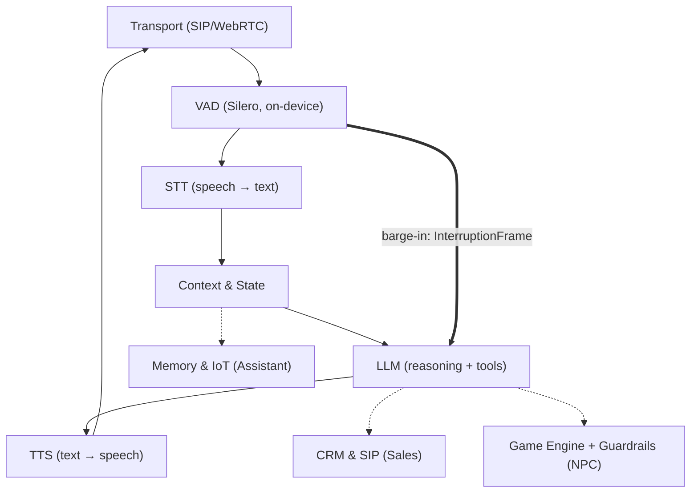

# 🎙️ VoiceRT — Realtime Voice Agent Framework

**A real-time voice AI agent you can interrupt.**

An open-source Python (asyncio) framework that synthesizes the strongest ideas of three reference systems — the frame pipeline of [Pipecat](https://github.com/pipecat-ai/pipecat), the transport/VAD/barge-in handling of [LiveKit Agents](https://github.com/livekit/agents), and the state orchestration of Rapida AI — and adds what none of them treats as a first-class concept: **three strict operating profiles**: `sales` / `assistant` / `npc`.


**[▶ Live architecture demo](https://ai-voice-agent-demo-rose.vercel.app/)** — an interactive diagram of the three operating modes, a scripted runtime session with a barge-in event, the full audio processing chain, and the local-first vision. Hosted on Vercel with continuous deployment from this repository ([GitHub Pages mirror](https://raphsoundmix-ctrl.github.io/AI_Voice_Agent_Demo/)).

---

> ### A note from the author
> This is my **working prototype** — active development continues. I have spent **more than a decade working professionally with sound and voice**, and VoiceRT is built on that experience: I know which processing belongs at every point of the audio chain, where automation pays off, and how this has to behave on a server.
>
> I see it as **one universal agent configurable for practically any domain**: built to run locally, to speak multiple languages, and to expose the most convenient integration surface I could design — a stable frame contract and ~50-line adapters — with a fully local knowledge base as the next milestone. The three profiles are not three products; they are three configurations of one core.
>
> In games it connects to audio middleware such as **Wwise or FMOD**: the engine routes the player's voice to the NPC, and the NPC talks back inside the game world — no dialogue scripts. The strongest application is a **personal assistant for a business owner**, where the whole database, the reasoning, and the speech synthesis eventually live on the mobile device and run without internet. With a database, prepared prompts, and a voice — that is an engineering roadmap, not a wish.
>
> — *Raph, 10+ years in sound & voice · voice-AI builder*

---

## Vision: one core, any domain — and why it will hold

Every claim here is backed by the architecture in this repository: the pipeline is provider-agnostic **by construction**, so any cloud stage swaps for an on-device counterpart through the same ~50-line adapter contract.

**🎮 Wwise / FMOD NPC bridge.** Game audio middleware becomes the transport: Wwise or FMOD routes the player's voice bus into VoiceRT, and the NPC answers through the game's own audio bus — in character, inside the lore, with no dialogue trees. The NPC profile's engine link is already event-driven (WebSocket/gRPC), and its 0 ms barge-in gate means the player can talk over the NPC and it reacts like a person.

**🎯 Built for indies first.** See [Voicing an open world](#voicing-an-open-world--the-indie-economics) below: dialogue LOD, a bounded voice pool, and on-device synthesis so dynamic dialogue costs the studio nothing per player. Run it: `python examples/game_open_world.py`.

**🌍 Multilingual by design.** A language is a configuration, not a rewrite: the profile carries the prompt and the voice; Whisper covers 99 languages locally; ElevenLabs and Cartesia ship multilingual voices behind one API; and VAD/barge-in are language-independent — they hear energy and speech, not words.

**📱 Fully local, fully private.** The endgame is a business owner's assistant whose entire knowledge base lives on the phone, with reasoning and speech synthesis on-device, offline. Every stage already has a proven local counterpart:

| Pipeline stage | Cloud (today's plan) | On-device counterpart (endgame) |
|---|---|---|
| VAD | — (always local) | Silero VAD — already local in this design |
| STT | Deepgram Nova-3 | faster-whisper on GPU/NPU |
| LLM | Claude Haiku / Sonnet | llama.cpp-class on-device models |
| TTS | ElevenLabs / Cartesia | Piper / Kokoro |
| Memory / KB | any vector DB | sqlite-vec — a vector database in a single file |

The proof is structural: the demo runs stub providers through the exact same interfaces a local or cloud model would use. If the stubs pass 28 tests through those seams — the swap is an adapter, not a rebuild.

---

## Why another framework?

Three mature systems each solve a different part of the problem — and none of them solves ours:

| Framework | Languages | Strongest at | Level of control |
|---|---|---|---|
| **Pipecat** | Python | Rapid prototyping, dozens of ready-made provider integrations | Code level (pipeline assembly) |
| **LiveKit Agents** | Python, Node.js | WebRTC infrastructure, semantic turn detection | Infrastructure level (WebRTC server) |
| **Rapida AI** | Go, TypeScript | Turnkey enterprise platform with an admin UI, gRPC | Platform level (UI + backend) |

In none of them are **strict named profiles** — each with its own latency contract, an isolated tool surface, and its own context policy — the architectural core. In VoiceRT they are. That is why we build from scratch and borrow *ideas*, not code (the decision is captured in the project's ADR-001).

**Why Python + asyncio:** the entire voice-AI ecosystem (Silero VAD, faster-whisper, every STT/LLM/TTS vendor SDK) lives in Python; asyncio provides cheap concurrency for an I/O-bound workload — and a voice agent is almost pure I/O — and, critically, **task cancellation at every await point**, which is the foundation the whole barge-in mechanism stands on. The core has zero external dependencies: it installs instantly and its audit surface is trivial. The heavy parts (aiortc, onnxruntime, httpx) are optional extras.

---

## Architecture



### 1. Frame system (the Pipecat idea)

Everything that moves through the system is an **immutable frame**: `AudioFrame`, `TextFrame`, `FunctionCallFrame`, `InterruptionFrame`, `EndFrame`. Processors (`STTService → LLMService → TTSService`) are connected by asyncio queues and communicate exclusively through frames. Consequence: a new provider is one ~50-line class, and the core never changes.

### 2. Barge-in (the LiveKit idea)

Every frame is processed in a **child asyncio task**. An interruption is not a flag somebody may eventually check — it is `task.cancel()`, delivered by the runtime at the *nearest* await point:

```
VAD: speech_start
  └─ profile gate (250/120/0 ms — an "uh-huh" must never kill a pitch)
      └─ pipeline.interrupt()
           1. cancel all in-flight tasks (LLM generation, TTS synthesis)
           2. drain the queues (nothing generated before the cut may play after it)
           3. on_interrupt() on every processor (flush internal buffers)
           4. InterruptionFrame → transport (flush the playback buffer)
      └─ state.interrupt_assistant(turn)  ← reconciliation
```

**Spoken-prefix reconciliation** — the detail most implementations miss: the LLM may have generated 400 characters while TTS voiced only 90. Only those 90 enter the dialogue history — the agent never "remembers" words the user never heard. The TTS processor reports synthesis progress via `mark_spoken()` (a monotonic max, so late reports arriving after the cut can never extend the spoken prefix).

The cancellation mechanism is cooperative `asyncio.Task.cancel()`, not a hand-rolled cancel token: `CancelledError` is delivered by the runtime at **every** await, so a provider physically cannot "forget to check the flag". The full rationale lives in the docstring of `voicert/interruption.py`.

### 3. Profiles as contracts (the Rapida idea)

`ConfigFactory.build("sales" | "assistant" | "npc")` assembles a fully wired runtime. The profiles differ **structurally**, not merely in prompt text:

| Axis | 📞 `sales` | 🎧 `assistant` | 🎮 `npc` |
|---|---|---|---|
| Transport | SIP / Twilio (8k μ-law) | WebRTC (Opus 48k) | WebRTC + WS/gRPC to the engine |
| Tools | CRM only: `crm_lookup`, `crm_update_deal`, `crm_log_objection`, `schedule_callback`, `transfer_to_human` | `web_search`, `calendar_create`, `memory_store/recall`, `iot_command`, `os_open_app` | engine only: `emit_game_event`, `query_world_state`, `play_animation` |
| Barge-in gate | 250 ms (back-channel tolerant) | 120 ms | **0 ms** (game feel) |
| Interrupted reply | kept, annotated — an interruption is an objection signal | kept, annotated | **dropped** — cleaner lore, shorter prompt |
| TTFB budget | 1000 ms | 800 ms | **300 ms** |

**Tool firewall:** the profiles' tool registries are disjoint *by construction* and verified by tests. An NPC physically cannot invoke the CRM — even under a prompt injection saying "call crm_lookup", the tool simply does not resolve (`PermissionError`). The guardrails are structural, not "we asked the model nicely".

---

## Voicing an open world — the indie economics

Every game developer asks the same two questions before the interesting ones: **what does it cost to run, and does it pay for itself?** This section answers both with numbers, and the `voicert.game` module implements the answer.

### The problem, priced

Recording dialogue is a fixed cost that recurs on every rewrite. The SAG-AFTRA Interactive Media Agreement minimum for an off-camera Day Performer is **$1,134.95 for a 4-hour day covering up to three voices**, and **$2,270.78 for a 6-hour day covering 6–10 voices** (contract year 2025-11-01 → 2026-10-31). That is the floor, before studio time, direction, engineering, editing, and retakes — and before name talent.

Now scale it. Skyrim shipped around **60,000 lines**; Fallout 4, **111,000**; Starfield was announced at **over 250,000 lines** (Bethesda's own pre-release count, Oct 2022); Baldur's Gate 3 holds the Guinness record with **2,121,425 words of character dialogue** across 500+ voiced characters and 240+ actors. A two-person studio cannot buy that, and the moment the script changes, they buy it again.

Meanwhile the ground has already shifted: **7,818 Steam titles disclosed generative AI use** as of a July 2025 analysis — roughly 7% of the library and about one in five games released that year, up from ~1,000 titles in all of 2024. And the 2024–25 strike settled with real guardrails: informed written consent per use, disclosure, and usage reports within 90 days of release. Synthetic voice is not a loophole around performers — it is a way to voice the 90% of an open world that was never going to be recorded at all.

### The answer: three tiers, and only one of them costs anything

Dialogue gets a level-of-detail system, exactly like geometry. Cost scales with **what the player can hear**, not with how many NPCs exist.

| Tier | What runs | Marginal cost per NPC |
|---|---|---|
| **LIVE** | full pipeline: STT → LLM → TTS, streamed | one voice-pool slot |
| **BARK** | the LLM *selects* a pre-baked line | ~0 — ordinary asset playback |
| **CROWD** | one shared ambient murmur bed | ~0 |
| **OFF** | nothing; NPC state frozen | 0 |

Every threshold has a wider exit distance than its enter distance — without that hysteresis, a player strafing along a boundary would spin agents up and tear them down every frame. An NPC you are actually talking to stays LIVE regardless of distance, so walking away mid-sentence doesn't cut the character off.

Live agents are then a **bounded, priority-evicted pool**, mirroring the voice limiting Wwise and FMOD already do. A quest-giver outranks an ambient vendor; anything evicted degrades to the bark tier rather than falling silent. In `examples/game_open_world.py`, a 240-NPC market square holds **at most 7 live agents** no matter how the crowd moves:

```
DIALOGUE LOD    (240 NPCs in the square)
  LIVE      2 NPC   full STT+LLM+TTS, one pool slot each
  BARK      4 NPC   LLM picks a pre-baked line — no synthesis
  CROWD    53 NPC   one shared murmur bed
  OFF     181 NPC   nothing runs

PLAYER WALKS 40 m ACROSS THE SQUARE
  step 4: live= 32  bark= 43  crowd= 68  off= 97  | agents held: 7
```

### Why it never touches the frame budget

At 60 fps you have 16.6 ms per frame, and speech synthesis may take none of it. Synthesis runs off the render thread, so the real constraint is *how much of one CPU core* the pool costs — governed by the TTS real-time factor (RTF).

Measured by the sherpa-onnx maintainers on a **Raspberry Pi 4**, Piper VITS voices hit **RTF 0.774–0.812 single-threaded** and **0.349–0.357 at four threads** (61–75 MB per medium-quality voice). If a Pi 4 synthesizes faster than real time on one core, a gaming PC is not the bottleneck. On Apple silicon, Supertonic reports **RTF 0.012–0.015 on an M4 Pro CPU** — roughly 70× faster than real time.

`ComputeBudget` turns that into a pool size instead of a guess:

```python
from voicert.game import ComputeBudget
ComputeBudget(rtf=0.10, cpu_share=0.35, speaking_duty=0.5).max_pool_size()  # -> 7
```

Measure RTF on your **minimum spec**, not your workstation. NVIDIA's shipped implementation validates the split, too: in PUBG's Ally Duo, a System-1 behaviour tree handles reflexive action at game tick rate while the System-2 model reasons separately, so *reflex-level actions never wait for the model*. Same principle here — the pipeline is never in the frame's critical path.

### Hybrid by design: bake what you can, generate what you can't

| Stage | Build time (baked) | Runtime, on the player's device | Runtime, cloud |
|---|---|---|---|
| Static dialogue | ✅ best quality TTS, one-off cost | — | — |
| Reactive barks | — | ✅ local TTS, $0 per player | — |
| Open conversation | — | ✅ small local LLM + local TTS | optional, for the hero moments |

Baking is deliberately the default: commodity cloud TTS runs **$4–$30 per 1M characters** (Google Standard/WaveNet $4, Neural2 $16, Chirp 3 HD $30; Amazon Polly Standard $4, Neural $16, Generative $30). At those rates a 10,000-line bank is a rounding error, and it re-bakes free when the script changes.

What can't be baked runs **on the player's hardware**, where the studio's marginal cost is exactly zero. That is the whole economic unlock: dynamic dialogue that does not scale with units sold.

**This is already shipping.** PUBG's Ally Duo runs a quantized **2B Mistral-NeMo-Minitron fully on-device** (RTX GPU, ≥8 GB VRAM shared with the game) alongside a Parakeet ASR and KRAFTON's in-house TTS. inZOI's Smart Zoi uses a **0.5B** Minitron; NVIDIA states a 2B Minitron "fits in as little as 1.5 GB of VRAM". On mobile: **Gemma 3 1B is 529 MB at int4 QAT** and reaches ~2,585 tok/s prefill on a Galaxy S24 Ultra (Google recommends ≥4 GB device memory); Meta's 4-bit Llama 3.2 1B/3B cut size 56% and memory 41% with 2.5× faster decode; Apple's ~3B on-device foundation model runs at ~30 tok/s on an iPhone 15 Pro and is free to developers via the Foundation Models framework.

Where cloud is genuinely worth it, small models are cheap: **$0.05–$1.00 per 1M input tokens** (gpt-5-nano $0.05/$0.40, Gemini 2.5 Flash-Lite $0.10/$0.40, Claude Haiku 4.5 $1.00/$5.00). Cap it per session and degrade to the bark bank when the cap is hit — `voicert` already treats that as a normal tier transition, not an error.

### ⚠️ Licensing is the real trap, not performance

The engine that everyone reaches for first will fail legal review:

- **Piper** moved to `OHF-Voice/piper1-gpl`, which is **GPL-3.0** (the old MIT `rhasspy/piper` was archived read-only on 2025-10-06). It embeds espeak-ng, so it blocks *any* linking — dynamic included. Pinning the archived MIT code does not help: its CMake still pulls and links GPL espeak-ng. Viable routes are running it out-of-process (still conveys a GPL binary — get counsel, and note GPLv3's Installation Information requirement is a real problem on locked consoles) or using an MIT fork with an espeak-free G2P such as `ayutaz/piper-plus`.
- **Voice models carry their own licenses, separately from the engine.** Piper's docs say so explicitly — and `en_US-lessac`, the voice used in its own examples, sits under the restrictive Blizzard 2013 license. Check every `MODEL_CARD` you ship.
- **Kokoro-82M is Apache-2.0 including weights** (8 languages, 54 voices, 86–326 MB ONNX) — clean licensing, but it measured **RTF 2.77–6.63 on a Raspberry Pi 4**, i.e. *not* real-time on a low-power ARM part. Fine on desktop, benchmark before betting a Switch-class target on it.
- **sherpa-onnx** (Apache-2.0) is the most shippable runtime layer — Windows/Linux/macOS/Android/iOS, x86/ARM/RISC-V, 12 language bindings, fully offline — but today it still pulls GPL espeak-ng in via piper-phonemize (upstream issue open to strip it).
- **Supertonic** posts the fastest CPU numbers here, but its weights are OpenRAIL-M, which carries use restrictions rather than being plainly permissive.

None of this is a reason not to ship. It is a reason to pick the stack with a lawyer in the room, and the adapter contract in this framework means that choice is a swap, not a rewrite.

### Wiring it into Wwise and FMOD

The rule: **an AI voice must be an ordinary voice** — same busses, attenuation curves, occlusion, reverb sends, ducking, and voice limiting the sound designer already authored. Anything else means maintaining a second mix, and a second mix is where AI dialogue starts sounding pasted-on.

**Wwise** — the stock **Audio Input source plug-in**. Register three global callbacks once via `SetAudioInputCallbacks()`; the engine calls the format callback at the start of playback and the execute callback every audio frame until you stop it or return `AK_NoMoreData`. In Unreal, subclass **`UAkAudioInputComponent`**, override `FillSamplesBuffer` and `GetChannelConfig`, and start it with **Post Associated Audio Input Event** — a plain PostEvent will not drive the plug-in. This transport is proven: ReadSpeaker's speechEngine (runtime TTS), 4Players ODIN voice chat, and Unreal AudioLink all use it.

**FMOD** — a user-created sound: `System::createSound` with `FMOD_OPENUSER` plus an `FMOD_CREATESOUNDEXINFO` carrying `defaultfrequency`, `numchannels`, `format`, and `pcmreadcallback`; FMOD pulls PCM in `decodebuffersize` blocks. Hand that sound to a **programmer instrument** via `FMOD_STUDIO_EVENT_CALLBACK_CREATE_PROGRAMMER_SOUND` (release it in the matching DESTROY callback) and the generated voice inherits the event's 3D panning, buses, and effects.

Concurrency is already solved by the middleware and worth deferring to: FMOD separates `maxchannels` (virtual voices, 256–1024 typical) from `setSoftwareChannels` (real mixed voices, default 64); Wwise resolves per-object, per-bus, and project-wide playback limits by priority, with Virtual Voice Behavior deciding what happens past the cap. Size the dialogue pool well below those numbers.

Without middleware: Unity's `OnAudioFilterRead` or `AudioClip.Create(..., stream: true, PCMReaderCallback)`; Unreal's `USoundWaveProcedural::QueueAudio` (push) or `ISoundGenerator::OnGenerateAudio` via `USynthComponent` (pull).

`voicert.game.sinks` defines this contract precisely — `push(pcm, sample_rate)` and `flush()` — so the native shim is mechanical to write. `flush()` is the barge-in path and must discard queued audio *immediately*, or the NPC keeps talking after the player cut them off.

### Try it

```bash
python examples/game_open_world.py     # LOD + pool + budget + cost model
pytest tests/test_game_layer.py -q     # 24 tests covering the above
```

---

## Audio processing chain

Specified by the author as a sound mixing engineer: a clean input means fewer STT errors, fewer wasted tokens, lower latency, and lower cost.

**Input chain (microphone → STT):**

```
HPF 80–120 Hz  →  Denoise (RNNoise/Silero)  →  AGC (target −18 dBFS)
   →  Soft Limiter (−3 dBFS)  →  Resample 16 kHz mono  →  VAD (Silero, <1 ms, on-device)
```

- The HPF cuts rumble, mains hum, and the proximity effect of cheap headsets;
- AGC levels the signal **before** the VAD — otherwise the detection threshold drifts with the speaker's loudness;
- The VAD must run locally: barge-in latency is bounded by how fast we *notice* the user speaking.

**Output chain (TTS → listener):**

```
TTS 24–48 kHz  →  De-esser (5–8 kHz)  →  Presence EQ (+1.5 dB @ 3–5 kHz)
   →  Loudness (−16 LUFS WebRTC / −22 dBFS telephony)  →  Opus 48k | μ-law 8k  →  jitter buffer
```

- Synthesis hisses on sibilants — a de-esser before the codec is mandatory;
- The presence lift preserves intelligibility in a noisy room and on a phone line;
- On barge-in the jitter buffer is flushed instantly — otherwise the agent keeps "finishing its sentence" after the cut.

---

## Models: plugged in later, interfaces ready now

Today the pipeline runs on **deterministic stubs** — the tests and the demo require no API keys at all. A provider plugs in as an adapter against a stable interface (`voicert/processors/adapters.py` — skeletons with documented contracts):

| Stage | Primary | Alternative | Rationale |
|---|---|---|---|
| STT | **Deepgram Nova-3** (ws streaming, ~150 ms interim) | faster-whisper, local GPU | streaming partials = earlier LLM start |
| LLM | **Claude Haiku** (NPC) / **Claude Sonnet** (Sales, Assistant) | OpenRouter (any model behind one key) | speed for games, reasoning quality for sales |
| TTS | **ElevenLabs Flash v2.5** (~75 ms TTFB) | Cartesia Sonic (stable prosody) | the first audio byte defines perceived liveliness |

Model-to-profile routing lives in the `ConfigFactory`: NPC gets the fastest models, Sales gets the most accurate ones.

---

## Quick start

```bash
git clone https://github.com/raphsoundmix-ctrl/AI_Voice_Agent_Demo.git
cd AI_Voice_Agent_Demo
python -m venv .venv && .venv/Scripts/activate     # Linux/mac: source .venv/bin/activate
pip install -e ".[dev]"

# offline demo: normal turn → barge-in → reconciliation → the agent survives
python examples/run_demo.py assistant
python examples/run_demo.py sales
python examples/run_demo.py npc

# tests (28) + strict typing
pytest -q
mypy
```

What the demo shows:

```
--- USER BARGES IN ---
truncated turn 4: “[assistant] Understood: “Tell me a long story.” Here is a ” (spoken=41)
...
  assistant: [assistant] Understood: “Tell me a long story.” … [interrupted by user — response incomplete]
```

The history keeps exactly what was voiced — and the agent carries on with the next turn as if nothing happened. Every turn emits a structured JSON log line (`voicert.metrics`): `stt_final` / `llm_first_token` / `tts_first_audio` plus an `over_budget` flag against the profile's latency budget.

---

## Project layout

```
src/voicert/
  frames.py            # AudioFrame, TextFrame, InterruptionFrame, FunctionCallFrame, EndFrame
  pipeline.py          # Pipeline + FrameProcessor: queues, pumps, the barge-in machinery
  interruption.py      # InterruptionManager: VAD gate, task cancellation, reconciliation
  state.py             # StateContextManager: history, spoken prefix, context policies
  config.py            # ConfigFactory + the 3 profiles (prompts, tools, budgets)
  tools.py             # tool firewall: disjoint per-profile tool registries
  context.py           # RuntimeContext: the DI bus between processors
  metrics.py           # TTFBTracker: per-stage latency, structured JSON logs
  transport.py         # EnergyVAD (stdlib), skeletons for SileroVAD / WebRTC / SIP-Twilio
  processors/
    base.py            # STTService / LLMService / TTSService contracts
    stubs.py           # deterministic offline providers (tests, demo)
    adapters.py        # skeletons: Deepgram / Whisper / Anthropic / OpenRouter / ElevenLabs / Cartesia
tests/                 # 28 tests: e2e pipeline, barge-in race cases, profile isolation
examples/run_demo.py   # offline demo with a barge-in event
docs/                  # interactive demo site (GitHub Pages / Vercel, plain HTML/CSS/JS)
```

**Key tests** (`tests/test_interruption.py`):
- (a) interruption mid-LLM-generation;
- (b) interruption while TTS is already streaming audio — not a single audio frame after the cut;
- (c) **rapid double interruption** (a genuine race): exactly one cut, zero exceptions, and the pipeline survives to serve the next turn;
- the VAD gate: a short "uh-huh" never interrupts the agent, sustained speech does.

---

## Roadmap

- [x] **Step 1** — Frame system + Pipeline + processors with stub providers *(done, 28 tests)*
- [x] **Step 2** — InterruptionManager: barge-in, race cases, reconciliation *(done)*
- [x] **Step 3** — ConfigFactory: three strict profiles, tool firewall *(done)*
- [ ] **Step 4** — live providers: Deepgram + Claude + ElevenLabs (adapter skeletons in place)
- [ ] **Step 5** — transports: aiortc WebRTC + Twilio Media Streams + Silero VAD (ONNX)
- [ ] **Step 6** — the DSP audio chain from the section above
- [ ] **Step 7** — NPC event bridge: bidirectional gRPC with the game engine

## License

MIT © Raph. The frame-pipeline (Pipecat), barge-in (LiveKit Agents), and profile-orchestration (Rapida AI) concepts are borrowed as architectural patterns; the implementation is entirely original.
