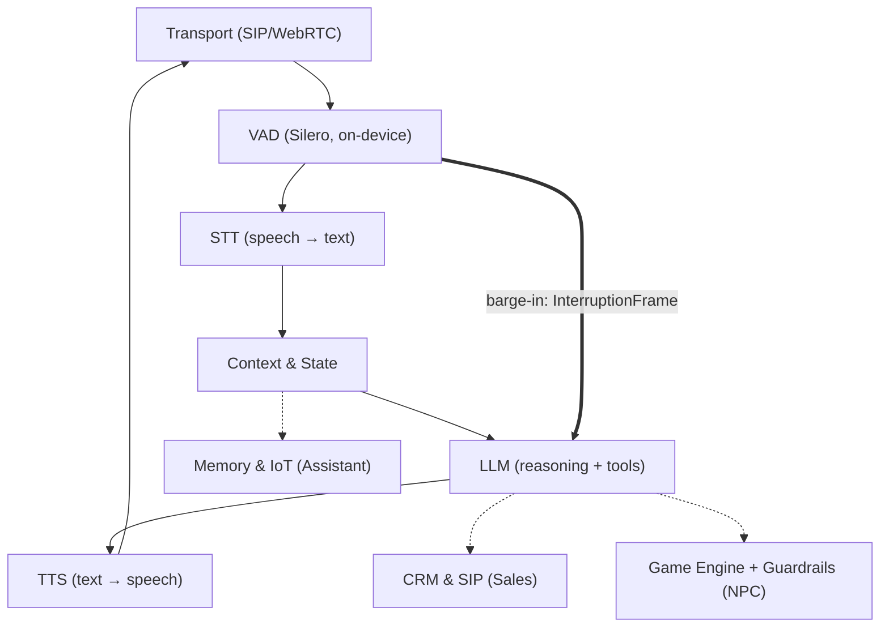

# 🎙️ VoiceRT — Realtime Voice Agent Framework

**A real-time voice AI agent you can interrupt.**

An open-source Python (asyncio) framework that synthesizes the strongest ideas of three reference systems — the frame pipeline of [Pipecat](https://github.com/pipecat-ai/pipecat), the transport/VAD/barge-in handling of [LiveKit Agents](https://github.com/livekit/agents), and the state orchestration of Rapida AI — and adds what none of them treats as a first-class concept: **three strict operating profiles**: `sales` / `assistant` / `npc`.


**[▶ Live architecture demo](https://raphsoundmix-ctrl.github.io/AI_Voice_Agent_Demo/)** — an interactive diagram of the three operating modes, a scripted runtime session with a barge-in event, and the full audio processing chain. The site is a static, dependency-free page (`docs/`); a ready-to-import `vercel.json` is included for one-click Vercel hosting as well.

---

> ### A note from the author
> This is my **working prototype** — active development continues. I build audio for a living (sound mixing is my profession), and VoiceRT reflects how I believe a voice agent should be engineered: **audio-first, latency-honest, and interruptible like a real conversation partner**.
>
> The three profiles are not three products — they are three configurations of **one universal core**. Swap the system prompt, the tool registry, and the latency budget, and the same agent adapts to practically any domain: sales floors, live events and conferences, support desks, in-game characters, field operations.
>
> — *Raph, sound mixing engineer · voice-AI builder*

---

## Why another framework?

Three mature systems each solve a different part of the problem — and none of them solves ours:

| Framework | Languages | Strongest at | Level of control |
|---|---|---|---|
| **Pipecat** | Python | Rapid prototyping, dozens of ready-made provider integrations | Code level (pipeline assembly) |
| **LiveKit Agents** | Python, Node.js | WebRTC infrastructure, semantic turn detection | Infrastructure level (WebRTC server) |
| **Rapida AI** | Go, TypeScript | Turnkey enterprise platform with an admin UI, gRPC | Platform level (UI + backend) |

In none of them are **strict named profiles** — each with its own latency contract, an isolated tool surface, and its own context policy — the architectural core. In VoiceRT they are. That is why we build from scratch and borrow *ideas*, not code (the decision is captured in the project's ADR-001).

**Why Python + asyncio:** the entire voice-AI ecosystem (Silero VAD, faster-whisper, every STT/LLM/TTS vendor SDK) lives in Python; asyncio provides cheap concurrency for an I/O-bound workload — and a voice agent is almost pure I/O — and, critically, **task cancellation at every await point**, which is the foundation the whole barge-in mechanism stands on. The core has zero external dependencies: it installs instantly and its audit surface is trivial. The heavy parts (aiortc, onnxruntime, httpx) are optional extras.

---

## Architecture



### 1. Frame system (the Pipecat idea)

Everything that moves through the system is an **immutable frame**: `AudioFrame`, `TextFrame`, `FunctionCallFrame`, `InterruptionFrame`, `EndFrame`. Processors (`STTService → LLMService → TTSService`) are connected by asyncio queues and communicate exclusively through frames. Consequence: a new provider is one ~50-line class, and the core never changes.

### 2. Barge-in (the LiveKit idea)

Every frame is processed in a **child asyncio task**. An interruption is not a flag somebody may eventually check — it is `task.cancel()`, delivered by the runtime at the *nearest* await point:

```
VAD: speech_start
  └─ profile gate (250/120/0 ms — an "uh-huh" must never kill a pitch)
      └─ pipeline.interrupt()
           1. cancel all in-flight tasks (LLM generation, TTS synthesis)
           2. drain the queues (nothing generated before the cut may play after it)
           3. on_interrupt() on every processor (flush internal buffers)
           4. InterruptionFrame → transport (flush the playback buffer)
      └─ state.interrupt_assistant(turn)  ← reconciliation
```

**Spoken-prefix reconciliation** — the detail most implementations miss: the LLM may have generated 400 characters while TTS voiced only 90. Only those 90 enter the dialogue history — the agent never "remembers" words the user never heard. The TTS processor reports synthesis progress via `mark_spoken()` (a monotonic max, so late reports arriving after the cut can never extend the spoken prefix).

The cancellation mechanism is cooperative `asyncio.Task.cancel()`, not a hand-rolled cancel token: `CancelledError` is delivered by the runtime at **every** await, so a provider physically cannot "forget to check the flag". The full rationale lives in the docstring of `voicert/interruption.py`.

### 3. Profiles as contracts (the Rapida idea)

`ConfigFactory.build("sales" | "assistant" | "npc")` assembles a fully wired runtime. The profiles differ **structurally**, not merely in prompt text:

| Axis | 📞 `sales` | 🎧 `assistant` | 🎮 `npc` |
|---|---|---|---|
| Transport | SIP / Twilio (8k μ-law) | WebRTC (Opus 48k) | WebRTC + WS/gRPC to the engine |
| Tools | CRM only: `crm_lookup`, `crm_update_deal`, `crm_log_objection`, `schedule_callback`, `transfer_to_human` | `web_search`, `calendar_create`, `memory_store/recall`, `iot_command`, `os_open_app` | engine only: `emit_game_event`, `query_world_state`, `play_animation` |
| Barge-in gate | 250 ms (back-channel tolerant) | 120 ms | **0 ms** (game feel) |
| Interrupted reply | kept, annotated — an interruption is an objection signal | kept, annotated | **dropped** — cleaner lore, shorter prompt |
| TTFB budget | 1000 ms | 800 ms | **300 ms** |

**Tool firewall:** the profiles' tool registries are disjoint *by construction* and verified by tests. An NPC physically cannot invoke the CRM — even under a prompt injection saying "call crm_lookup", the tool simply does not resolve (`PermissionError`). The guardrails are structural, not "we asked the model nicely".

---

## Audio processing chain

Specified by the author as a sound mixing engineer: a clean input means fewer STT errors, fewer wasted tokens, lower latency, and lower cost.

**Input chain (microphone → STT):**

```
HPF 80–120 Hz  →  Denoise (RNNoise/Silero)  →  AGC (target −18 dBFS)
   →  Soft Limiter (−3 dBFS)  →  Resample 16 kHz mono  →  VAD (Silero, <1 ms, on-device)
```

- The HPF cuts rumble, mains hum, and the proximity effect of cheap headsets;
- AGC levels the signal **before** the VAD — otherwise the detection threshold drifts with the speaker's loudness;
- The VAD must run locally: barge-in latency is bounded by how fast we *notice* the user speaking.

**Output chain (TTS → listener):**

```
TTS 24–48 kHz  →  De-esser (5–8 kHz)  →  Presence EQ (+1.5 dB @ 3–5 kHz)
   →  Loudness (−16 LUFS WebRTC / −22 dBFS telephony)  →  Opus 48k | μ-law 8k  →  jitter buffer
```

- Synthesis hisses on sibilants — a de-esser before the codec is mandatory;
- The presence lift preserves intelligibility in a noisy room and on a phone line;
- On barge-in the jitter buffer is flushed instantly — otherwise the agent keeps "finishing its sentence" after the cut.

---

## Models: plugged in later, interfaces ready now

Today the pipeline runs on **deterministic stubs** — the tests and the demo require no API keys at all. A provider plugs in as an adapter against a stable interface (`voicert/processors/adapters.py` — skeletons with documented contracts):

| Stage | Primary | Alternative | Rationale |
|---|---|---|---|
| STT | **Deepgram Nova-3** (ws streaming, ~150 ms interim) | faster-whisper, local GPU | streaming partials = earlier LLM start |
| LLM | **Claude Haiku** (NPC) / **Claude Sonnet** (Sales, Assistant) | OpenRouter (any model behind one key) | speed for games, reasoning quality for sales |
| TTS | **ElevenLabs Flash v2.5** (~75 ms TTFB) | Cartesia Sonic (stable prosody) | the first audio byte defines perceived liveliness |

Model-to-profile routing lives in the `ConfigFactory`: NPC gets the fastest models, Sales gets the most accurate ones.

---

## Quick start

```bash
git clone https://github.com/raphsoundmix-ctrl/AI_Voice_Agent_Demo.git
cd AI_Voice_Agent_Demo
python -m venv .venv && .venv/Scripts/activate     # Linux/mac: source .venv/bin/activate
pip install -e ".[dev]"

# offline demo: normal turn → barge-in → reconciliation → the agent survives
python examples/run_demo.py assistant
python examples/run_demo.py sales
python examples/run_demo.py npc

# tests (28) + strict typing
pytest -q
mypy
```

What the demo shows:

```
--- USER BARGES IN ---
truncated turn 4: “[assistant] Understood: “Tell me a long story.” Here is a ” (spoken=41)
...
  assistant: [assistant] Understood: “Tell me a long story.” … [interrupted by user — response incomplete]
```

The history keeps exactly what was voiced — and the agent carries on with the next turn as if nothing happened. Every turn emits a structured JSON log line (`voicert.metrics`): `stt_final` / `llm_first_token` / `tts_first_audio` plus an `over_budget` flag against the profile's latency budget.

---

## Project layout

```
src/voicert/
  frames.py            # AudioFrame, TextFrame, InterruptionFrame, FunctionCallFrame, EndFrame
  pipeline.py          # Pipeline + FrameProcessor: queues, pumps, the barge-in machinery
  interruption.py      # InterruptionManager: VAD gate, task cancellation, reconciliation
  state.py             # StateContextManager: history, spoken prefix, context policies
  config.py            # ConfigFactory + the 3 profiles (prompts, tools, budgets)
  tools.py             # tool firewall: disjoint per-profile tool registries
  context.py           # RuntimeContext: the DI bus between processors
  metrics.py           # TTFBTracker: per-stage latency, structured JSON logs
  transport.py         # EnergyVAD (stdlib), skeletons for SileroVAD / WebRTC / SIP-Twilio
  processors/
    base.py            # STTService / LLMService / TTSService contracts
    stubs.py           # deterministic offline providers (tests, demo)
    adapters.py        # skeletons: Deepgram / Whisper / Anthropic / OpenRouter / ElevenLabs / Cartesia
tests/                 # 28 tests: e2e pipeline, barge-in race cases, profile isolation
examples/run_demo.py   # offline demo with a barge-in event
docs/                  # interactive demo site (GitHub Pages / Vercel, plain HTML/CSS/JS)
```

**Key tests** (`tests/test_interruption.py`):
- (a) interruption mid-LLM-generation;
- (b) interruption while TTS is already streaming audio — not a single audio frame after the cut;
- (c) **rapid double interruption** (a genuine race): exactly one cut, zero exceptions, and the pipeline survives to serve the next turn;
- the VAD gate: a short "uh-huh" never interrupts the agent, sustained speech does.

---

## Roadmap

- [x] **Step 1** — Frame system + Pipeline + processors with stub providers *(done, 28 tests)*
- [x] **Step 2** — InterruptionManager: barge-in, race cases, reconciliation *(done)*
- [x] **Step 3** — ConfigFactory: three strict profiles, tool firewall *(done)*
- [ ] **Step 4** — live providers: Deepgram + Claude + ElevenLabs (adapter skeletons in place)
- [ ] **Step 5** — transports: aiortc WebRTC + Twilio Media Streams + Silero VAD (ONNX)
- [ ] **Step 6** — the DSP audio chain from the section above
- [ ] **Step 7** — NPC event bridge: bidirectional gRPC with the game engine

## License

MIT © Raph. The frame-pipeline (Pipecat), barge-in (LiveKit Agents), and profile-orchestration (Rapida AI) concepts are borrowed as architectural patterns; the implementation is entirely original.
