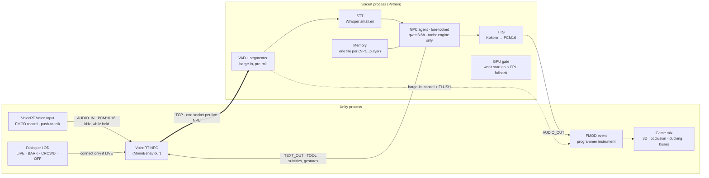

# VoiceRT — Talk to any NPC


**Real-time, interruptible voice for game NPCs. Unity + FMOD first. Runs on the player's GPU.**

The player holds a key and talks. The NPC answers in character, in its own voice, through an FMOD event in the game's own mix. Speech recognition, the language model and the voice all run locally: no API key, no per-turn bill.

This README is the engineering view: architecture, the wire protocol, what is measured and what is not. The product and business view lives on the site: **[voice-rt-agent.vercel.app](https://voice-rt-agent.vercel.app/)**.


<!-- TODO(Raph): record 20-30 s Unity scene: mic → NPC → FMOD event, barge-in shown. Then uncomment:

-->

---

## Contents

- [Status: what is verified, what is not](#status-what-is-verified-what-is-not)
- [Architecture](#architecture)
- [One turn, end to end](#one-turn-end-to-end)
- [Barge-in](#barge-in)
- [The NPC contract](#the-npc-contract)
- [Wire protocol](#wire-protocol)
- [Unity package](#unity-package)
- [Running it](#running-it)
- [Measurements](#measurements)
- [Game layer: dialogue LOD and the voice pool](#game-layer-dialogue-lod-and-the-voice-pool)
- [Economics](#economics)
- [Repository map](#repository-map)
- [Tests](#tests)
- [Roadmap](#roadmap)
- [License](#license)

---

## Status: what is verified, what is not

| Component | State | Evidence |
|---|---|---|
| Python runtime: pipeline, barge-in, NPC contract, memory, engine bridge, economics ledger | shipped | 229 pytest, mypy strict on 34 files, no API keys or GPU needed for CI |
| Local GPU stack: Whisper `small.en` → `qwen3:8b` (Ollama) → Kokoro v1.0 fp32 (sherpa-onnx) | runs end to end | boot-time GPU gate; p50 **489 ms** end of speech → first audio (n=10, scripted speech input, editor idle), **850–1100 ms** with the game rendering on the same GPU |
| Unity package: FMOD programmer-instrument sink (M1) | shipped | compiled in Unity 6 (6000.6) with FMOD for Unity 2.03.14, heard through a real microphone; a Windows player build runs on the development machine (its config still holds that machine's paths, so it is not packaged for other machines yet) |
| Unity package: plain `AudioSource` sink | shipped | same build; 21 xUnit tests on the engine-agnostic C# core, including a full turn plus a barge-in against a live Python bridge |
| Unreal plugin (`USoundWaveProcedural` playback) | prototype | protocol verified in standalone C++; never compiled inside an Editor |
| Wwise | documented contract only | `voicert.game.sinks` describes the Audio Input wiring (`UAkAudioInputComponent`); there is no plugin code for it yet |
| Cloud adapters: Deepgram, Claude Haiku, OpenRouter, ElevenLabs, Cartesia | interface only | raise `NotImplementedError` until M3 |

Limits, stated up front so nobody has to find them:

- **English only.** Speech recognition is Whisper `small.en`. Every planned provider is multilingual, but nothing else is wired.
- **Windows + NVIDIA CUDA is the only measured platform.** The server refuses to start if any stage fell back to the CPU (`--allow-cpu` overrides it). Phones and consoles are not benchmarked; Kokoro is not real time on low-power ARM (RTF 2.77–6.63 on a Raspberry Pi 4).
- **Latency is over budget under load.** The NPC profile's budget is 300 ms to first audio. Idle, the stack does ~0.5 s; with the game rendering on the same GPU, 0.85–1.1 s. One GPU has three tenants — Kokoro's first chunk goes from 123.6 ms to 347.2 ms while the 8B model decodes beside it — and closing that gap is the next engineering target.
- **The demo project is not in this repo yet.** The Unity scene that starts the server by itself and shows barge-in on screen is milestone M2. With the package alone, you start the server yourself ([Running it](#running-it)).

---

## Architecture


```mermaid
flowchart LR
    subgraph U["Unity process"]
        MIC["VoiceRT Voice Input<br/>FMOD record · push-to-talk"]
        LOD["Dialogue LOD<br/>LIVE · BARK · CROWD · OFF"]
        NPC["VoiceRT NPC<br/>(MonoBehaviour)"]
        FMOD["FMOD event<br/>programmer instrument"]
        MIX["Game mix<br/>3D · occlusion · ducking · buses"]
    end
    subgraph V["voicert process (Python)"]
        VAD["VAD + segmenter<br/>barge-in, pre-roll"] --> STT["STT<br/>Whisper small.en"] --> LLM["NPC agent · lore-locked<br/>qwen3:8b · tools: engine only"] --> TTS["TTS<br/>Kokoro → PCM16"]
        MEM["Memory<br/>one file per (NPC, player)"] --- LLM
        GATE["GPU gate<br/>won't start on a CPU fallback"]
    end
    MIC -- "AUDIO_IN · PCM16 16 kHz, while held" --> NPC
    LOD -- "connect only if LIVE" --> NPC
    NPC == "TCP · one socket per live NPC" ==> VAD
    TTS -- "AUDIO_OUT" --> FMOD --> MIX
    VAD -. "barge-in: cancel + FLUSH" .-> FMOD
    LLM -- "TEXT_OUT · TOOL → subtitles, gestures" --> NPC
```

**Two processes, on purpose.** Everything heavy — VAD, STT, the LLM, TTS, the voice pool — stays in the Python process on the GPU. The engine gets a thin client: one socket per live NPC, PCM queued into an ordinary engine sound, text and tool calls forwarded to your MonoBehaviour. The engine never runs a model, so no model ever has to fit inside the 16.6 ms frame at 60 fps, and a model failure is a dropped socket rather than a crashed game. The Unreal plugin is the same client in C++, playing through `USoundWaveProcedural`; a Wwise path (`UAkAudioInputComponent` in the FMOD slot) exists only as a documented contract so far.

**Frames, not callbacks.** Everything moving through the runtime is an immutable frame (`AudioFrame`, `TextFrame`, `FunctionCallFrame`, `InterruptionFrame`, `EndFrame`). Processors (`STTService`, `LLMService`, `TTSService`) are joined by asyncio queues and only ever see frames, so a provider is one ~50-line class and the core never changes. The core is stdlib-only asyncio; local models and cloud SDKs are optional extras. Internals: [docs/architecture.md](docs/architecture.md).

---

## One turn, end to end

1. **Capture.** One `VoiceRT Voice Input` per player records through FMOD Core; Unity's `Microphone` is the fallback (on the reference machine `Microphone.devices` came back empty while FMOD, in the same process, listed eight endpoints). The device rate is resampled to 16 kHz with the fractional read position carried across chunks, and streamed as `AUDIO_IN` only while the push-to-talk key is held.
2. **Utterance.** On the server, `EnergyVAD` opens capture and drives barge-in; `UtteranceSegmenter` prepends 300 ms of pre-roll (a VAD needs energy before it fires — without pre-roll Whisper hears "ello"), drops anything under 250 ms and force-flushes past 20 s.
3. **Endpoint.** Releasing the key sends `ENDPOINT`, which closes the utterance immediately instead of paying the VAD's 450 ms hangover on every turn. A client that has sent `ENDPOINT` owns the turn boundary: a pause mid-sentence is not the end of one.
4. **Speech in.** Whisper `small.en` gets the whole utterance (chunk-by-chunk transcription produces confident nonsense). While the player is still talking, a partial transcript over the last 3 s is produced at most every 0.55 s and sent back as `STT` for a live caption; the answer is never built from a partial.
5. **Who is speaking.** `voicert.game.agents` assembles the system prompt from the world file (`examples/worlds/harbour-town.json`: shared lore, each character's role, knowledge, voice and how they turn a question away) plus what this character remembers about this player. The restriction goes last, and it gives the model a line to say ("that word is gibberish to you") rather than only a prohibition.
6. **The reply.** `qwen3:8b` streams through Ollama. `SentenceBuffer` releases whole clauses, so TTS can place stress and breath instead of giving every word its own falling intonation. `llm_first_token` is stamped by the provider on the first token, so buffering never shows up as model latency.
7. **Voice.** Kokoro (fp32, sherpa-onnx CUDA) synthesizes each clause; the PCM goes out as `AUDIO_OUT` at the TTS rate (24 kHz for Kokoro, announced in `READY`), the words as `TEXT_OUT` for subtitles, gestures as `TOOL`.
8. **Into the mix.** In Unity the socket thread writes into a `PcmRingBuffer`; FMOD's mixer thread pulls it through a user-created sound (`FMOD_OPENUSER` + `pcmreadcallback`) handed to the event's programmer instrument on `CREATE_PROGRAMMER_SOUND`. Everything downstream — spatializer, buses, snapshots, ducking, reverb sends — is authored in FMOD Studio by the sound designer, exactly as for recorded dialogue.
9. **Close.** `TURN_END` carries the turn's metrics; the conversation is written to that (NPC, player) memory file.

---

## Barge-in

An interruption is not a flag that something checks later. Each frame is handled in its own child task, and a cut is `task.cancel()`, delivered at the next await point:

```
VAD: speech_start
  └─ profile gate (0 ms for the NPC: game feel beats politeness)
      └─ pipeline.interrupt()
           1. cancel everything in flight (LLM generation, TTS synthesis)
           2. drain the queues, so nothing produced before the cut plays after it
           3. on_interrupt() on every processor, to flush buffers
           4. InterruptionFrame → transport → FLUSH to the engine
      └─ state.interrupt_assistant(turn)   # history keeps only what was voiced
```

Three details carry most of the weight:

- **History keeps what was voiced.** The LLM may have written 400 characters while TTS voiced 90. Only those 90 enter history (`mark_spoken()` only moves forward, so a late progress report cannot stretch it). The NPC profile goes further and drops the interrupted reply entirely: cleaner lore, shorter prompt.
- **Cut what is playing, not what is running.** Kokoro synthesizes about ten times faster than the words are spoken, so a nine-second reply is fully generated in under a second — by the time the player interrupts, the pipeline is often idle and the engine still has seconds queued. The server flushes everything it has sent since the last cut; the client drops its ring buffer on `FLUSH`. **Known gap:** the client does not report how much it has played, so after a late cut like this the character's memory still holds the whole reply that was sent, not only the part the player heard.
- **The tail FMOD already decoded.** FMOD reads ahead `decodeBufferSamples` (1024 by default, 64 ms at 16 kHz) that a flush cannot reach. `hardCutOnFlush` restarts the event to discard it, at the cost of an event restart.

The race cases are tested, not assumed (`tests/test_interruption.py`): a cut mid-generation, a cut while TTS is streaming with no audio frame allowed through afterwards, two cuts fired at once (exactly one wins, no deadlock, the next turn still works), and the VAD gate telling a short "uh-huh" from a real interruption.

---

## The NPC contract

`ConfigFactory.build("npc")` returns a wired runtime. The profile is a contract, not a prompt:

| | `npc` |
|---|---|
| Transport | engine bridge: one TCP socket per live NPC, PCM16 mono both ways |
| Tools | `emit_game_event`, `query_world_state`, `play_animation` — nothing else |
| Barge-in gate | **0 ms** |
| Interrupted reply | **dropped** from history |
| Turn boundary | owned by a push-to-talk client once it sends `ENDPOINT`; open-mic clients endpoint on silence |
| Latency budget | first LLM token **150 ms**, first audio **300 ms**, both measured from the end of the player's speech (deadlines, not added together; `over_budget` fires on the second) |
| Memory | one JSON file per (NPC, player), read before the reply, written after; there is no query that could return the guard's memory to the fruit vendor |

**The tool set is closed.** A prompt-injected "search the web" or "read that file" has nothing to resolve to: `ToolRegistry.get` raises `PermissionError`, and the tests call four out-of-engine tool names to prove it. The guardrail is the structure, not prompt discipline.

**A character is a derived profile.** `ConfigFactory.build` also takes a `ProfileConfig`, so each character keeps the contract and changes only what makes it that character:

```python
from dataclasses import replace
from voicert.config import PROFILES, ConfigFactory

guard = replace(PROFILES["npc"], name="guard",
                prompt_vars={"character": "Brann, a gate guard", "lore_scope": "the north gate"})
runtime = ConfigFactory.build(guard)   # same tools, gate, budgets, context policy
```

---

## Wire protocol

TCP, no dependencies on either side. One connection is one NPC; the engine's dialogue LOD decides which NPCs hold one, and `max_sessions` caps it server-side as a backstop. Every frame:

```
type (1 byte) | length (4 bytes, big-endian, unsigned) | payload     max payload 4 MiB
```

| Dir | Type | Name | Payload |
|---|---|---|---|
| → | `0x01` | `HELLO` | JSON `{"proto":1, "npc_id", "character", "lore_scope", "voice", "player_id"}` |
| → | `0x02` | `TEXT_IN` | UTF-8 text the player typed |
| → | `0x03` | `AUDIO_IN` | PCM16 mono 16 kHz microphone audio (runs VAD → barge-in) |
| → | `0x04` | `EVENT` | JSON `{"event", "payload"}`: an in-game event for the NPC |
| → | `0x05` | `INTERRUPT` | empty: the engine detected the player talking over the NPC |
| → | `0x06` | `LOD` | JSON `{"tier", "distance_m", "priority"}` |
| → | `0x07` | `ENDPOINT` | empty: push-to-talk released, end the utterance now |
| ← | `0x81` | `READY` | JSON `{"npc_id", "sample_rate", "channels":1, "format":"pcm16"}` |
| ← | `0x82` | `AUDIO_OUT` | PCM16 mono at `READY.sample_rate`: queue it into the engine's audio source |
| ← | `0x83` | `TEXT_OUT` | JSON `{"text", "turn_id"}`: words as they are voiced, for subtitles and visemes |
| ← | `0x84` | `TURN_END` | JSON `{"turn_id", "metrics"}` |
| ← | `0x85` | `FLUSH` | empty: barge-in, drop every queued sample now |
| ← | `0x86` | `TOOL` | JSON `{"tool_name", "arguments", "call_id"}`, e.g. `play_animation` |
| ← | `0x87` | `STATE` | JSON `{"state"}`: `idle`, `listening`, `processing`, `speaking`, `interrupted`, `error` |
| ← | `0x88` | `STT` | JSON `{"text", "final"}`: what the player was heard to say |
| ← | `0x8F` | `ERROR` | JSON `{"message"}` |

The protocol is implemented three times from one spec — Python (`voicert.game.bridge`), engine-agnostic C# (`integrations/unity/com.voicert.npc/Runtime/Core/VoiceRTProtocol.cs`) and header-only C++17 (`integrations/unreal/VoiceRT/Source/VoiceRT/Public/VoiceRTProtocol.h`) — and the C# side is tested against the real Python server, not against a copy of it.

Per live NPC the audio costs ~32 KB/s of PCM16 at 16 kHz in each direction (48 KB/s out at Kokoro's 24 kHz); the FMOD sink holds up to `bufferSeconds` of it (30 s by default, because a whole reply arrives long before it is spoken).

---

## Unity package

`integrations/unity/com.voicert.npc` — UPM package, Unity 2021.3+, verified in Unity 6 (6000.6) with FMOD for Unity 2.03.14.

| Component | What it does |
|---|---|
| **VoiceRT NPC** | One per character. Holds the bridge connection (`host`, `port`, `npcId`, `character`, `voice`) and raises `onSubtitle`, `onTool`, `onTurnEnd`, `onFlush`, `onState`, `onTranscript`, `onReady`, `onError`. `Say(text)` drives a typed turn. |
| **VoiceRT FMOD Sink** | Creates and owns one `EventInstance` from an `EventReference` whose only instrument is a programmer instrument, and feeds it from the ring buffer. Compiled only when FMOD for Unity is in the project: `Editor/VoiceRTFmodDefine.cs` sets `VOICERT_FMOD`, and the `VoiceRT.Fmod` assembly is constrained on it. |
| **VoiceRT AudioSource Sink** | The no-middleware path: a streaming `AudioClip` on an ordinary `AudioSource`. |
| **VoiceRT Voice Input** | One per player, not per NPC; the game points it at whoever is being spoken to and calls `BeginUtterance()` / `EndUtterance()` from its own input system. Push-to-talk by default: with an open mic the VAD hears the NPC through the speakers and interrupts itself. Backends behind `IVoiceRTMicSource`: FMOD Core record (primary), `UnityEngine.Microphone` (fallback). A loop buffer (5 s on FMOD, 10 s on the Unity fallback) with overrun detection keeps a stalled frame from handing over stale audio. |
| **VoiceRT Dialogue LOD** | Distance tiers with hysteresis (LIVE 6/9 m, BARK 25/32 m, CROWD 60/75 m by default) and a conversation override; opens and closes the socket as the player crosses the LIVE band. |

`Tools~/MicCheck` is a standalone device checker for the case the capture code was built around: the default Windows microphone is often a virtual endpoint that records silence, or a physical one another process holds (`ERR_RECORD`). The runtime walks past both on its own; MicCheck shows you why.

Install: `Window > Package Manager > + > Add package from git URL`, pointing at the package subfolder (the repo root is not a package):

```
https://github.com/raphsoundmix-ctrl/voicert.git?path=/integrations/unity/com.voicert.npc
```

---

## Running it

### No GPU, no keys: the tests and the stub demo

```bash
git clone https://github.com/raphsoundmix-ctrl/voicert.git
cd voicert
python -m venv .venv && .venv/Scripts/activate     # Linux/macOS: source .venv/bin/activate
pip install -e ".[dev]"

pytest -q && mypy                      # 229 tests, strict typing
python examples/run_demo.py            # one turn, a barge-in, then the NPC carries on (stub providers)
python examples/game_open_world.py     # dialogue LOD, pool, budget and cost model for 240 NPCs
python -m voicert.game.bridge 127.0.0.1 8765   # the bridge on stubs, for wiring a client
```

### The local GPU server

```bash
pip install -e ".[local,cuda,bench]"   # faster-whisper, httpx, sherpa-onnx, CUDA 12 runtime DLLs, psutil
# sherpa-onnx on PyPI is CPU-only; install the CUDA wheel as described in docs/local-stack.md
ollama pull qwen3:8b

python -m voicert.game.local_server --tts-dir <path-to>/kokoro-multi-lang-v1_0 --port 8767
# VOICERT READY 127.0.0.1:8767 rate=24000 voices=54
```

Everything is loaded and warmed before the listener opens, so the first NPC a player walks up to answers as fast as the tenth; a launcher waits for the `VOICERT READY` line. If Ollama is not answering, the server starts `ollama serve` itself, and it sets `HF_HUB_OFFLINE=1` so nothing touches the network once models are on disk (`--online` for the first install). `VOICERT_TTS_DIR` can replace `--tts-dir`. Useful flags: `--llm`, `--whisper`, `--world`, `--state-dir`, `--no-memory`, `--forget`, `--max-sessions`, `--vad-hangover-ms`, `--allow-cpu`; `--help` lists all of them.

### Docker

`Dockerfile` + `docker-compose.yml` run the bridge in a container as a non-root user, on stubs or backed by Ollama on the host (`--profile local`). On Windows, `.\voicert.ps1 up`, `up -Local`, `test` and `health` wrap Compose; the healthcheck is a real `HELLO` → `READY` handshake, not a port probe.

---

## Measurements

All on the reference workstation (RTX 4080 16 GB, i9-12900K, Windows 11). Method and caveats: [docs/local-stack.md](docs/local-stack.md).

| What | Result |
|---|---|
| End of speech → first NPC audio, full local stack | p50 **489 ms** (n=10, scripted speech input via `examples/npc_voice_probe.py`, editor idle) · **850–1100 ms** with the game rendering on the same GPU |
| Kokoro fp32 on CUDA (v1.1 benchmark, idle GPU; the stack ships v1.0) | RTF **0.07–0.11**, first chunk 175 ms / 91 ms (1.6 s / 5 s sentence); int8 on CUDA is RTF 1.85 because the quantized ops round-trip through the CPU, so use fp32 on the GPU |
| Whisper `small.en` vs `base.en` | **4.6 %** vs 12.0 % word error over ten spoken lines, for +27 ms and +400 MiB; `base.en` heard "Who is Elon Musk?" as "Who is a lawn musk?" |
| Holding the character (six probes against the guard persona) | `qwen3:1.7b` 3/6 · `qwen3:4b` 2/6 · `qwen3:8b` **6/6** at 5.6 GB VRAM |
| Local LLM latency (12-turn tavern keeper) | `qwen3:1.7b` warm TTFT 45 ms, full reply ~121 ms · `qwen3:14b` TTFT ~41 ms, full reply ~710 ms: decode speed separates models, not TTFT |
| Barge-in through the live gate | 1,546 ms of buffered reply cut to 0 ms in 7 ms |

The model was chosen by the role-holding probe, not by latency: a smaller model answers sooner and stops being the character (`qwen3:1.7b` explained quantum entanglement to a night guard).

---

## Game layer: dialogue LOD and the voice pool

What you pay for is what the player can hear, not how many NPCs exist.

| Tier | What runs | Voice pool | LLM work |
|---|---|---|---|
| **LIVE** | full pipeline: STT → LLM → TTS, streamed | one slot | a streamed generation |
| **BARK** | the LLM picks a line from a pre-baked bank | none | one short classification call |
| **CROWD** | one shared murmur bed | none | none |
| **OFF** | nothing, NPC state frozen | none | none |

Live agents come out of a fixed-size pool with priority eviction, the way FMOD and Wwise already limit voices; an evicted NPC degrades to BARK, never to silence. The pool size is computed, not guessed: `ComputeBudget(rtf=0.10, cpu_share=0.35, speaking_duty=0.5).max_pool_size()` returns 7. `examples/game_open_world.py` walks a player across a 240-NPC market square:

```
PLAYER WALKS 40 m ACROSS THE SQUARE
  step 1: live=  2  bark= 13  crowd= 63  off=162  | agents held: 2
  step 3: live= 15  bark= 36  crowd= 68  off=121  | agents held: 7
  step 4: live= 32  bark= 43  crowd= 68  off= 97  | agents held: 7  ← capped
```

`live=` is how many NPCs qualify for the LIVE tier; `agents held:` is how many got a pool slot. This is the simulation: the pool and the BARK/CROWD tiers are implemented and tested in `voicert.game`, but the bridge server does not use the pool yet — it caps concurrent NPC sessions with `--max-sessions` (8 by default), and the Unity `VoiceRT Dialogue LOD` component opens and closes sockets by distance. Details, hysteresis and bake-vs-generate: [docs/economics.md](docs/economics.md#four-tiers-and-only-one-of-them-is-expensive).

---

## Economics

`voicert.economics` prices a turn against vendor rate cards read on 2026-08-31 (`python tools/unit_economics.py`). The turn: 282 fresh + 700 cached prompt tokens, 23 output tokens and 92 characters synthesized, measured over a 12-turn conversation on `qwen3:1.7b`, plus an assumed 3 s of player audio. The tool flags two of the rates as promotional.

| stack | per turn | LLM | STT | TTS | $15 buys |
|---|---|---|---|---|---|
| all cloud, cheap | $0.001532 | 1.7% | 8.2% | **90.1%** | 9,792 turns |
| all cloud, premium | $0.005307 | 8.8% | 4.5% | **86.7%** | 2,826 turns |
| cloud brain, local voice | $0.000152 | 17.7% | 82.3% | 0% | 98,814 turns |
| premium brain, local voice | $0.000707 | 66.1% | 33.9% | 0% | 21,216 turns |
| fully on-device (what the demo runs) | $0.000000 | 0% | 0% | 0% | unbounded |

Speech synthesis is ~90% of a cloud voice turn; the LLM is under 2%. At $10 net per player and a 90% margin target, the cheapest all-cloud stack funds 652 turns; moving only synthesis on-device funds 6,587. For cloud stages there is a spending-ceiling ledger, built and tested but not yet wired into the bridge (it goes in with the cloud providers, M3): money is integer nano-dollars, the ledger reserves before a turn and settles after it (safe under concurrency), `BudgetDenied` carries an affordable authored fallback line, and barge-in stops the meter. Full argument and caveats: [docs/economics.md](docs/economics.md).

---

## Repository map

```
src/voicert/             frames, pipeline, interruption, state, config (NPC profile), tools (firewall),
                         metrics, transport (EnergyVAD, loopback), utterance (segmenter), qos (Windows scheduling)
src/voicert/processors/  base contracts · stubs (deterministic, for CI) · local (Whisper, Ollama + SentenceBuffer,
                         Kokoro via sherpa-onnx) · adapters (cloud skeletons, M3)
src/voicert/game/        bridge (TCP protocol) · local_server + local_stack (GPU stack, GPU gate) · agents (world file,
                         memory per NPC and player) · session (state machine) · lod · pool · budget · sinks
src/voicert/economics/   money (integer nano-dollars) · prices · usage · ledger (reserve / settle) · planning
integrations/unity/      com.voicert.npc UPM package (FMOD sink, mic backends, LOD, MicCheck) + C# xUnit tests
integrations/unreal/     VoiceRT .uplugin (header-only C++17 protocol, FSocket client) + standalone C++ tests
examples/                run_demo.py · game_open_world.py · npc_chat.py (terminal conversation) · run_local_npc.py ·
                         npc_voice_probe.py (speech in, without a person) · stt_bench.py · resmon.py · worlds/
docker/, Dockerfile      the bridge as a container; voicert.ps1 wraps Compose on Windows
tools/unit_economics.py  prints the cost table from measured usage
docs/                    the site (index.html) + architecture · economics · licensing · middleware-wiring ·
                         audio-chain · local-stack · POSITIONING
```

Several probes in `examples/` default to the reference workstation's model paths; each takes a flag to override them.

---

## Tests

`pytest -q`: **229 passed**, no network, no GPU, no keys. Providers are deterministic stubs behind the same interfaces as the real ones; the GPU gate and the Ollama autostart are tested against monkeypatched device and process reports.

| File | Tests | Covers |
|---|---|---|
| `test_economics.py` | 46 | integer money, rate cards, the reserve/settle ledger under concurrency, ceilings that hold |
| `test_agents.py` | 39 | world files, prompt assembly, memory per (NPC, player), Windows-safe file names, interrupted lines not replayed as finished |
| `test_game_layer.py` | 23 | LOD tiers and hysteresis, pool eviction, compute budget |
| `test_local_gpu.py` | 20 | CUDA DLL discovery, sherpa-onnx CUDA detection and provider resolution, the int8-on-GPU guard, first-token timing |
| `test_local_server_boot.py` | 19 | Ollama autostart and its failure modes, offline mode set before the model hub loads, the GPU gate (CPU voice or recogniser, LLM split or not in VRAM) |
| `test_bridge.py` | 17 | framing, HELLO/READY with the TTS rate, error paths, a text turn over a real socket, INTERRUPT → FLUSH, tools forwarded, session cap, abrupt disconnects |
| `test_session_state.py` | 16 | the per-NPC state machine, clauses never repeated, sentence cutting without punctuation |
| `test_utterance.py` | 16 | pre-roll, minimum length, stuck-VAD flush, a pause under a held key does not split the utterance, open mic still endpoints on silence |
| `test_config_factory.py` | 14 | the NPC contract and the tool firewall |
| `test_interruption.py` | 9 | barge-in races, the stock NPC's instant cut, both context policies |
| `test_pipeline.py` | 6 | frames end to end, metrics, immutability |
| `test_turn_closing.py` | 4 | a failed turn still closes, memory survives a failure, a cut turn stays open for reconciliation |

C#: `dotnet test integrations/unity/tests/VoiceRT.Core.Tests`, **21 passed**, compiled against the package's own sources (no copy drift), including a test that launches the Python bridge and drives a full turn plus a barge-in over a real socket. C++: `integrations/unreal/tests/build_and_test.bat` (MSVC or g++), no Unreal needed.

---

## Roadmap

- [x] Core runtime, barge-in with history repair, the NPC contract, game layer, TCP engine bridge, economics ledger.
- [x] **M1** FMOD programmer-instrument sink, compiled in Unity 6 with FMOD for Unity 2.03.14, verified with a real microphone on the full local stack; a Windows player build starts its own server on the development machine.
- [ ] **M2** Demo scene in the repo and a 30-second video: mic → NPC → FMOD event, barge-in and memory on screen.
- [ ] **M3** Cloud providers (Deepgram, Claude Haiku, ElevenLabs Flash) running end to end behind the same adapters, next to the local path that already does, with the spending ceiling wired in.
- [ ] **M4** UPM 0.1 release; Unreal + Wwise at parity.

---

## Team

Raph (Rafael Kuldashev): more than ten years in sound and voice; the design comes from the mix, not from an SDK. Vyacheslav Romanenko: 14+ years of technical sound design and FMOD on PC, console and mobile. VoiceRT is in the Fall 2026 cohort of AltaLab, the accelerator run by AltaIR Capital.

## License

All rights reserved, © 2026 Raph. The source is published for technical review; it is not open source, and no license to use, copy, modify or distribute it is granted without written permission. Third-party runtimes keep their own licenses; see [docs/licensing.md](docs/licensing.md) (Piper is GPL-3.0 now; Kokoro and sherpa-onnx are Apache-2.0; FMOD needs its own licence). Pipecat, LiveKit Agents and Rapida AI were studied as design references; every design decision and the implementation here are original.
