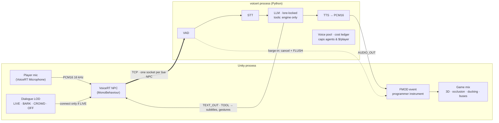

# Architecture

How a player's microphone becomes an in-character NPC reply, and why the runtime is built the way it is. The [README](../README.md) has the short version; this is the long one.

## The pipeline



Unreal + Wwise is the same picture with `UAkAudioInputComponent` in the FMOD slot.

### Engine bridge

`voicert.game.bridge` is the Python side of a small TCP protocol built for this. Everything heavy — VAD, the LLM, TTS, the voice pool — stays in the Python process. Each engine gets a thin client: a few hundred lines that open one socket per live NPC, queue the incoming audio into an ordinary engine sound, and forward text and tool calls to your MonoBehaviour or Blueprint graph. The engine never runs a model.

```
┌─────────────── engine process (Unity / Unreal) ───────────────┐   ┌──────── voicert process ────────┐
│                                                                 │   │                                  │
│  NPC actor                                                     │   │  EngineBridgeServer (asyncio)     │
│  ┌──────────────┐   distance, priority    ┌─────────────────┐  │   │  one connection = one NPC turn    │
│  │ Dialogue LOD │ ───────────────────────▶│ VoiceRT NPC      │──┼───┼─▶ ConfigFactory.build("npc")      │
│  │ (per-actor)  │  connect only if LIVE   │ component/script │  │TCP│    ├─ STT · VAD · barge-in         │
│  └──────────────┘                          └─────────────────┘  │   │    ├─ LLM (lore-locked prompt)     │
│         ▲                                        │  ▲           │   │    └─ TTS → PCM16 mono 16 kHz      │
│         │ player position each frame             │  │ AUDIO_OUT │   │                                  │
│         │                                  TEXT_IN│  │TEXT_OUT  │   │  NPCVoicePool caps concurrent      │
│  ┌──────────────┐                                 │  │TURN_END  │   │  live agents (see cost model      │
│  │ AudioSource / │◀── PCM16 ring buffer ───────────┘  │FLUSH     │   │  above) — bounded regardless of   │
│  │ SoundWaveProc.│    (resampled to device rate)      │TOOL      │   │  how many NPCs exist in the world │
│  └──────────────┘                                     ▼          │   │                                  │
│    3D attenuation, occlusion,               subtitles · gestures │   └──────────────────────────────────┘
│    reverb — all engine-native               · animation triggers │
└─────────────────────────────────────────────────────────────────┘
```

One TCP connection per LIVE-tier NPC; everyone in BARK/CROWD/OFF holds no connection at all, so the socket count on the engine side already matches `NPCVoicePool.capacity`, not the size of the world.

### Frames instead of callbacks

Everything moving through the system is an immutable frame: `AudioFrame`, `TextFrame`, `FunctionCallFrame`, `InterruptionFrame`, `EndFrame`. The processors (`STTService`, `LLMService`, `TTSService`) are joined by asyncio queues and talk only in frames. Adding a provider means writing one class of about 50 lines. The core stays untouched.

### Barge-in

Each frame is handled in its own child asyncio task. An interruption is not a flag that something checks later. It is `task.cancel()`, and the runtime delivers it at the next await point:

```
VAD: speech_start
  └─ profile gate (0 ms for the NPC: game feel beats politeness)
      └─ pipeline.interrupt()
           1. cancel everything in flight (LLM generation, TTS synthesis)
           2. drain the queues, so nothing produced before the cut plays after it
           3. on_interrupt() on every processor, to flush buffers
           4. InterruptionFrame → transport, to flush playback
      └─ state.interrupt_assistant(turn)
```

That last step matters more than it looks. The LLM may have written 400 characters while TTS only voiced 90. Only those 90 go into the dialogue history, so the agent never "remembers" words the user never heard. The TTS processor reports progress through `mark_spoken()`, which only ever moves forward, so a late report arriving after the cut cannot stretch the spoken part.

Cancellation uses `asyncio.Task.cancel()` rather than a hand-rolled flag. The runtime raises `CancelledError` at every await, so a provider cannot forget to check anything. Full reasoning is in the docstring of `voicert/interruption.py`.

## The NPC is a contract

`ConfigFactory.build("npc")` returns a wired runtime. The NPC profile is a contract, not a prompt:

| | `npc` |
|---|---|
| Transport | engine bridge: one TCP socket per live NPC, PCM16 mono 16 kHz each way |
| Tools | engine only: `emit_game_event`, `query_world_state`, `play_animation` |
| Interrupt gate | **0 ms**, because game feel beats politeness |
| Interrupted reply | **dropped**, for cleaner lore and a shorter prompt |
| Context policy | the history keeps only what was voiced |
| First LLM token | **150 ms** |
| First audio out | **300 ms** |

Both latency numbers are deadlines measured from the same moment, the end of the player's speech, so they are not added together. `over_budget` in the logs fires when the first audio chunk misses the second one.

The tool set is closed. Tests check this: even if a prompt injection tells the NPC to call a tool outside the engine, the tool is not in the registry and the call raises `PermissionError`. The guardrail is in the structure, not in the prompt. Other profiles exist in `ConfigFactory` only to prove tool sets cannot overlap; they are not on the roadmap.

## Design references

Three mature voice-agent systems were studied for how production pipelines are put together. Each solves a different part of the problem:

| Framework | Languages | Best at | Level |
|---|---|---|---|
| **Pipecat** | Python | Fast prototyping, many ready integrations | Code (you assemble the pipeline) |
| **LiveKit Agents** | Python, Node.js | WebRTC infrastructure, semantic turn detection | Infrastructure (WebRTC server) |
| **Rapida AI** | Go, TypeScript | Turnkey platform with an admin UI, gRPC | Platform (UI plus backend) |

None of them treats the NPC as a contract: a fixed latency budget (150 ms to the first token, 300 ms to the first audio), an engine-only tool set that a prompt cannot widen, and a context policy that drops what the player never heard. VoiceRT does. That is why they were used as references to learn from rather than as code to build on. Nothing here is ported.

**Why Python and asyncio.** The voice-AI ecosystem lives in Python: Silero VAD, faster-whisper, every vendor SDK. A voice agent is almost pure I/O, and asyncio handles that cheaply. Most importantly, asyncio can cancel a task at any await point, and barge-in is built directly on that.

The core has no external dependencies. It installs in seconds and there is very little to audit. The heavy pieces (aiortc, onnxruntime, httpx) are optional extras.

---

## Models: interfaces now, providers later

The pipeline currently runs on deterministic stubs, so the tests and the demo need no API keys. A real provider plugs in as an adapter against a stable interface. See `voicert/processors/adapters.py` for the skeletons.

| Stage | First choice | Alternative | Why |
|---|---|---|---|
| STT | **Deepgram Nova-3** (ws streaming, ~150 ms interim) | faster-whisper, local GPU | streaming partials let the LLM start earlier |
| LLM | **Claude Haiku** (first token inside the 150 ms budget) | OpenRouter, any model behind one key; Ollama for the local path | a 14B model that holds character costs 5.9× the reply time of a 1.7B that does not (see local-stack.md) |
| TTS | **ElevenLabs Flash v2.5** (~75 ms TTFB) | Cartesia Sonic, steadier prosody | the first audio byte is what makes it feel alive |

`ConfigFactory` gives the NPC the fastest model that still holds character; the measured local path is in [local-stack.md](local-stack.md).

---

## Source layout

```
src/voicert/
  frames.py            # AudioFrame, TextFrame, InterruptionFrame, FunctionCallFrame, EndFrame
  pipeline.py          # Pipeline + FrameProcessor: queues, pumps, the barge-in machinery
  interruption.py      # InterruptionManager: VAD gate, task cancellation, history repair
  state.py             # StateContextManager: history, spoken prefix, context policies
  config.py            # ConfigFactory: the NPC profile (prompt, tools, budgets); other profiles kept only to prove tool isolation
  tools.py             # tool registries; the NPC's is engine-only and a prompt cannot widen it
  context.py           # RuntimeContext: the shared bus between processors
  metrics.py           # TTFBTracker: per-stage latency, structured JSON logs
  transport.py         # EnergyVAD (stdlib), SileroVAD skeleton, the utterance-segmenter hook
  processors/
    base.py            # STTService / LLMService / TTSService contracts
    stubs.py           # deterministic offline providers for tests and the demo
    adapters.py        # skeletons: Deepgram / Whisper / Anthropic / OpenRouter / ElevenLabs / Cartesia
  game/
    lod.py             # dialogue LOD: LIVE / BARK / CROWD / OFF with hysteresis
    pool.py            # fixed-size agent pool with priority eviction
    sinks.py           # FMOD programmer-sound and Wwise Audio Input contracts
    budget.py          # CPU budget to pool size, and the recorded-vs-synthesized cost model
  economics/           # runtime money, enforced like the latency budget
    money.py           # integer nano-dollars; why not float, why not Decimal
    prices.py          # LLM / STT / TTS rate cards with source and expiry
    usage.py           # what a turn consumed -> what it costs (pure)
    ledger.py          # reserve / settle / abandon, degrade instead of fail
    planning.py        # affordable turns, required local share, ceiling from revenue
tests/                 # 121 tests: pipeline, barge-in races, tool isolation, game layer, cost ceilings
examples/              # run_demo.py (voice loop) and game_open_world.py (240-NPC square)
tools/                 # unit_economics.py — prints the cost table from measured usage
docs/                  # site (index.html, app.js, styles.css) + architecture / economics / licensing / middleware-wiring / audio-chain / local-stack
```

The interruption tests are the ones worth reading (`tests/test_interruption.py`):

- interrupting in the middle of LLM generation
- interrupting while TTS is already streaming, with no audio frame allowed through after the cut
- two interruptions fired at once, a real race: exactly one cut, no exceptions, and the pipeline still serves the next turn
- the VAD gate, where a short "uh-huh" does not interrupt but sustained speech does
